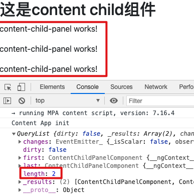

# ContentChild与ContentChildren

> ```ContentChild```与```ContentChildren```跟我们上一节介绍的```ViewChild```与```ViewChildren```用法几乎一致。他们都是装饰器，但是区别在于，前者是获取投影（```ng-content```）中的组件、元素等。

## @ContentChild()

```ContentChild```的元数据跟```ViewChild```一样，也是有下面三个：

- ```selector``` - 用于查询的指令类型或名字。

- ```read``` - 从查询到的元素中读取另一个令牌。

- ```static``` - 如果为```true```，则在更改检测之前解析查询结果；如果为```false```，则在更改检测之后解析查询结果。默认为```false```。

### 获取普通DOM

默认你已经了解```<ng-content>```的用法：

```html
<!-- content-child.component.html -->
<div class="content-child-box">
  <h2>这是content child组件</h2>
  <div class="head" style="border: 1px solid; margin: 10px 0;">
    <ng-content select=".head"></ng-content>
  </div>
  <ng-content></ng-content>
</div>
```

父组件传入内容：

```html
<!-- app.component.html -->
<app-content-child>
  <p class="head">传入的头部</p>
  <p #other>其他内容</p>
</app-content-child>
```

获取元素：

```typescript
// content-child.component.ts
...
export class ContentChildComponent implements OnInit, AfterViewInit {
  // 这样是获取不到元素的
  @ContentChild('.head', {static: true}) private headEl: ElementRef<HTMLSpanElement>;
  @ContentChild('other', {static: true}) private otherEl: ElementRef<HTMLDivElement>;
  constructor() { }
  ngOnInit(): void {}
  ngAfterViewInit(): void {
    console.log(this.headEl); // undefined
    console.log(this.otherEl.nativeElement); // <div _ngcontent-teu-c17="">其他内容</div>
  }
}
```

***上面获取元素的方式有个特别注意的地方：```ContentChild```的```selector```参数不能是css的类选择器以及标签选择器！***

*获取组件就不介绍了吧，如不熟悉，参阅上一节*

## @ContentChildren()

三个元数据介绍：

- ```selector``` - 用于查询的指令类型或名字。

- ```descendants``` - 如果为true，则包括所有后代，否则仅包括直接子代，默认false。

- ```read``` - 用于从查询的元素中读取不同的标记。

用法类似```ViewChildren```, 批量获取投影中到组件或指令。

先创建一个子组件：

```
ng g c components/content-child/content-child-panel -s
```

修改```content-child```组件：

```html
<!-- content-child.component.html -->
<div class="content-child-box">
  <h2>这是content child组件</h2>
  <ng-content></ng-content>
</div>
```
传入三个```content-child-panel```组件：

```html
<!-- app.component.html -->
<app-content-child>
  <app-content-child-panel></app-content-child-panel>
  <app-content-child-panel></app-content-child-panel>
  <div class="foot">
    <app-content-child-panel></app-content-child-panel>
  </div>
</app-content-child>
```

获取组件：

```typescript
// content-child.component.ts
...
export class ContentChildComponent implements OnInit, AfterViewInit {
  @ContentChildren(ContentChildPanelComponent) private panels: QueryList<ContentChildPanelComponent>;
  constructor() { }
  ngOnInit(): void {}
  ngAfterViewInit(): void {
    console.log(this.panels);
  }
}
```

浏览器日志：



从上面的结果可以看出：页面上显示了三个子组件，但是我们获取到的组件只有前两个，因为元数据中```descendants```默认为```false```。

想要获取所有子组件，请开启```descendants```：

```typescript
@ContentChildren(ContentChildPanelComponent, {descendants: true}) private panels: QueryList<ContentChildPanelComponent>;
```

## 总结

1. ```ContentChild```与```ContentChildren```是获取投影中的组件、指令及元素```DOM```等；

2. ```ContentChildren```开启```descendants```才能获得所有子组件。