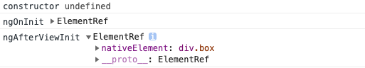

> 在任何js框架下，获取元素都是常用且重要的操作。这一节，我们将介绍Angular中如何使用```ViewChild```来获取```DOM```元素、组件、指令。

在这之前，我们需要先了解一个Angular的生命周期函数```AfterViewInit```

## AfterViewInit

定义：一个生命周期钩子，会在 Angular 完全初始化了组件的视图后调用。

在组件中注入这个钩子函数后，就必须实现它的方法```ngAfterViewInit()```。（不用担心，编辑器会提示你的）

### ngAfterViewInit()

一个回调方法，它会在 Angular 完成了组件视图的初始化逻辑之后立即调用。 在视图初始化完成之后，它只会调用一次。

## @ViewChild()

**官方定义**

属性装饰器，用于配置一个视图查询。变更检测器会在视图的```DOM```中查找能匹配上该选择器的第一个元素或指令。 如果视图的```DOM```发生了变化，出现了匹配该选择器的新的子节点，该属性就会被更新。

通俗的来讲，***就是Angular 中的‘选择器’，能及时的获取模板中的元素（```DOM```元素、组件、指令）。***

**元数据说明**

元数据，我觉得就跟函数的参数一样。```ViewChild```可以有三个参数：

- ```selector``` - 用于查询的指令类型或名字。

- ```read``` - 从查询到的元素中读取另一个令牌。

- ```static``` - 如果为```true```，则在更改检测之前解析查询结果；如果为```false```，则在更改检测之后解析查询结果。默认为```false```。

> tips:我们将新建一个```view-child```组件来展示本节全部代码

### 获取普通dom

修改```view-child```组件```html```代码:

```html
<!-- view-child.component.html -->
<section>
  <h3>获取dom</h3>
  <div class="box" #box>
    <p>box</p>
  </div>
</section>
```

***提醒：上面代码给```class```名为```box```的```div```添加了```#box```标识，这样的作用有点类似给元素添加了一个```id```值。***

首先，给```ViewChildComponent```这个类注入```AfterViewInit```这个钩子函数：

```typescript
// view-child.component.ts
export class ViewChildComponent implements OnInit, AfterViewInit {}
```
这个时候，你会发现编辑器会报错，所以，你需要按照编辑器提示来引入```AfterViewInit```，并且实现```ngAfterViewInit```这个接口。

```typescript
// view-child.component.ts
import { AfterViewInit, Component, OnInit } from '@angular/core';
...
export class ViewChildComponent implements OnInit, AfterViewInit {
  constructor() { }
  ngAfterViewInit(): void {}
  ngOnInit(): void {}
}
```

接下来，我们通过获取页面上```#box```来判断```constructor```、```ngAfterViewInit```、```ngOnInit```调用时机:

```typescript
// view-child.component.ts
import { AfterViewInit, Component, ElementRef, OnInit, ViewChild } from '@angular/core';
...
export class ViewChildComponent implements OnInit, AfterViewInit {
  // 定义私有属性boxEl，是ElementRef类型。
  @ViewChild('box') private boxEl: ElementRef;
  constructor() { 
    console.log('constructor', this.boxEl);
  }
  ngAfterViewInit(): void {
    console.log('ngAfterViewInit', this.boxEl);
  }
  ngOnInit(): void {
    console.log('ngOnInit', this.boxEl);
  }
}
```

浏览器控制台日志如下：


可以得出结论：

1. 三个函数调用顺序是：```constructor``` > ```ngOnInit``` > ```ngAfterViewInit```;

2. 默认在变更检测之后才会获取到元素，而```ngAfterViewInit```就是在变更检测之后才会调用。

> tips: 所谓变更检测，大概意思是Angular每次更新视图前会去检测内部逻辑的变化，只更新有变化的部分。

#### static属性

> 上面的示例中默认在变更检测之后才会获取到目标元素，可开启static，这样组件初始化的时候，变更检测前就能获取到目标

```typescript
// view-child.component.ts
...
export class ViewChildComponent implements OnInit, AfterViewInit {
  // 定义私有属性boxEl，是ElementRef类型。
  @ViewChild('box', { static: true }) private boxEl: ElementRef;
  ...
}
```
这样，在```ngOnInit```和```ngAfterViewInit```阶段都能获取到页面的元素了：



***如果想要获取的元素在页面上始终存在，没有被```ngIf```之类的控制，或者想要更早获取的话，建议开启```static```***

### 获取子组件（指令）

> 以组件为例，获取到组件实例后可以访问子组件到属性和方法，指令用法和组件一摸一样

在```view-child```下面创建一个```panel```组件:

```
ng g c components/view-child/panel -s
```
```typescript
// panel.component.ts
...
export class PanelComponent implements OnInit {
  readonly name = 'panel component';
  ...
}
```

```view-child```组件调用：

```html
<!-- view-child.component.html -->
<app-panel></app-panel>
<app-panel #panel></app-panel>
```
获取组件：

```typescript
// view-child.component.ts
import { PanelComponent } from './panel/panel.component';
...
export class ViewChildComponent implements OnInit, AfterViewInit {
  // 方法1: 引入PanelComponent组件，ViewChild直接获取PanelComponent
  @ViewChild(PanelComponent, {static: true}) private panelInstance: PanelComponent;
  // 方法2: 引入PanelComponent组件，ViewChild直接获取PanelComponent
  @ViewChild('panel', {static: true}) private panelInstance2: PanelComponent;
  ...
  ngAfterViewInit(): void {
    // 既然是组件的实例，那么，我们就能访问组件里面的属性及方法
    console.log(this.panelInstance.name); // panel component
    console.log(this.panelInstance2.name); // panel component
  }
}
```

#### 获取组件中的DOM元素

首先在子组件的构造函数中注入```el```:

```typescript
// panel.component.ts
...
export class PanelComponent implements OnInit {
  constructor(readonly el: ElementRef) { }
  ...
}
```
获取：

```typescript
// view-child.component.ts
...
export class ViewChildComponent implements OnInit, AfterViewInit {
  ngAfterViewInit(): void {
    console.log(this.panelInstance.el.nativeElement);
  }
  ...
}
```

## @ViewChildren()

> 与```ViewChild```类似，它可以批量获取模板上相同选择器的元素并存放到[QueryList](https://angular.cn/api/core/QueryList#querylist)类中。```ViewChildren```没有```static```属性

### 批量获取DOM元素

```html
<!-- view-child.component.html -->
<section>
  <p class="box" #box>box1</p>
  <p class="box" #box>box2</p>
  <p class="box" #box>box3</p>
</section>
```

获取：

```typescript
// view-child.component.ts
import { QueryList} from '@angular/core';
...
export class ViewChildComponent implements OnInit, AfterViewInit {
  // 定义私有属性boxEls，是ElementRef组成的QueryList类型。
  @ViewChildren('box') private boxEls: QueryList<ElementRef>;
  ngAfterViewInit(): void {
    console.log(this.boxEls);
  }
  ...
}
```

浏览器打印结果：


### 批量获取组件

（跟上面类似，就不介绍了）

## 总结

1. ViewChild用于获取单个元素，ViewChildren可以批量获取元素；
2. ViewChild默认不开启static，不能在constructor以及ngOnInit中获取元素；如果元素是静态或者想要更早获取，请开启static；
3. ***如果想要获取的元素在页面上始终存在，没有被```ngIf```之类的控制，或者想要更早获取的话，建议开启```static```***
4. 获取组件可以通过模版标识或者组件类名来进行选择；
5. QueryList下面有众多属性及一些方法，详细查看[文档](https://angular.cn/api/core/QueryList#querylist)。


