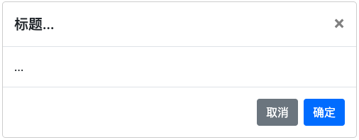
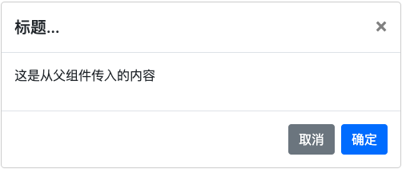
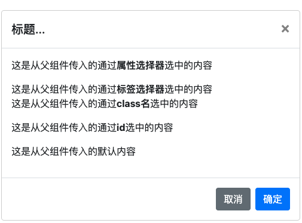

## ng-content

上一节我们介绍了NgTemplateOutlet指令，它可以实现类似<slot>标签的功能，但是呢，好像离真正的<slot>还是差了一点点距离。<ng-content>，就是我们想要的那一个。

到目前为止，我们调用组件的形式是下面的形式（以以前的dialog组件为例）：

```html
<!-- app.component.html -->
<app-dialog></app-dialog>
```

页面效果是这样的：



弹窗组件，其内容部分应该是可以完全定制的，也就是在调用的时候指定内容的。使用上节内容，其实可以实现，但是不是最优解。对于这样的需求，请使用<ng-content>:

```html
<!-- dialog.component.html -->
...
<div class="modal-body">
  <ng-content></ng-content>
</div>
...
```

修改调用形式：

```html
<!-- app.component.html -->
<app-dialog>
  <p>这是从父组件传入的内容</p>
</app-dialog>
```

页面效果是这样的：



上面实现了我们想要的需求，但是功能太基础了。如果我们想传入内容到不同的位置呢？请看下面：

```html
<!-- dialog.component.html -->
...
<div class="modal-body">
  <ng-content select="[attr]"></ng-content>
  <ng-content select="article"></ng-content>
  <ng-content></ng-content>
</div>
...
```

```html
<!-- app.component.html -->
<app-dialog>
  <p attr>这是从父组件传入的通过<b>属性选择器</b>选中的内容</p>
  <p>这是从父组件传入的默认内容</p>
  <article>这是从父组件传入的通过<b>标签选择器</b>选中的内容</article>
</app-dialog>
```

页面效果是这样的：



***从上面可以看出，<ng-content>有一个select属性，需要接收一个选择器，从而控制传入的内容显示在我们想要的地方。***

