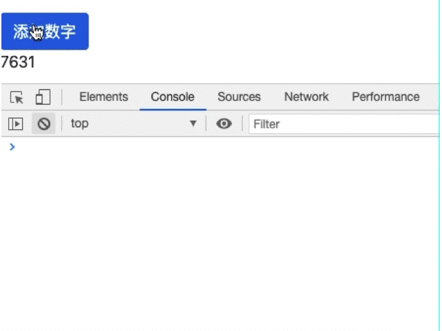

# Pipe

> 管道，通过逻辑简单处理模板中数据的一种方式，用法简单，是开发中很重要的简化代码的利器。

**元数据说明**

- ```name: string``` --在模板中绑定时使用的管道名。 通常使用 ```lowerCamelCase``` 拼写方式，因为名字中不允许包含减号（```-```）。

- ```pure?: boolean``` --为 ```true``` 时，该管道是纯管道，也就是说 ```transform()``` 方法只有在其输入参数变化时才会被调用。管道默认都是纯管道。

**用法**

```html
{{ exp | myPipe }}
```

## 内置管道

```Angular```有很多内置管道供我们使用，下面是常用的内置管道（[更多](https://angular.cn/api/common#pipes)）：

- [AsyncPipe](https://angular.cn/api/common/AsyncPipe) --自动订阅模板中的```Observable```或```Promise```
- [CurrencyPipe](https://angular.cn/api/common/CurrencyPipe) --把数字转换成金额字符串， 根据本地化规则进行格式化
- [DatePipe](https://angular.cn/api/common/DatePipe) --根据区域设置规则格式化日期值
- [DecimalPipe](https://angular.cn/api/common/DecimalPipe) --数字转字符串，并可以指定格式
- [KeyValuePipe](https://angular.cn/api/common/KeyValuePipe) --使```ngFor```可以循环```Object```或```Map```对象
- [JsonPipe](https://angular.cn/api/common/JsonPipe) --把一个值转换成```JSON```字符串格式。在调试时很有用。
- [TitleCasePipe](https://angular.cn/api/common/TitleCasePipe) --把首字母大写，其它小写
- [SlicePipe](https://angular.cn/api/common/SlicePipe) --截取```Array```或```String```
- [PercentPipe](https://angular.cn/api/common/PercentPipe) --数字转百分比
- [LowerCasePipe](https://angular.cn/api/common/LowerCasePipe)和[UpperCasePipe](https://angular.cn/api/common/UpperCasePipe) --转化小写或大写


### KeyValuePipe

以前我们```ngFor```的时候都是循环的数组，通过```KeyValuePipe```，我们可以循环```Object```或```Map```对象。

创建```pipe```组件：

```
ng g c components/pipe -s
```

创建普通对象以及```Map```对象：

```typescript
// pipe.component.ts
...
export class PipeComponent implements OnInit {
  obj:{[key: number]: string} = {2: 'foo', 1: 'bar'};
  map = new Map([[2, 'foo'], [1, 'bar']]);
  ...
}
```

循环：

```html
<!-- pipe.component.html -->
<div class="pipe">
  <div *ngFor="let item of obj | keyvalue">
    {{item.key}}: {{item.value}}
  </div>
  <div *ngFor="let item of map | keyvalue">
    {{item.key}}: {{item.value}}
  </div>
</div>
```

## 自定义管道

> 下面定义一个将数字指数化的管道```exponentialStrength```。如```{{5 | exponentialStrength: 3}}```，表示```5的3次方```。

```
ng g p pipe/exponentialStrength
```

tips: 执行上面的命令后，```cli```工具会自动引入相应模块到```app.module.ts```中

修改代码：

```typescript
// exponential-strength.pipe.ts
import { Pipe, PipeTransform } from '@angular/core';
@Pipe({
  // 管道名字
  name: 'exponentialStrength'
})
export class ExponentialStrengthPipe implements PipeTransform {
  // 实现transform方法，返回处理过后的数字
  transform(value: number, exponent?: number): number {
    return Math.pow(value, isNaN(exponent) ? 1 : exponent);
  }
}
```

创建一个管道就这么简单，我们就能在任意模版中使用。

```html
<!-- 5的3次方 -->
<p>{{5 | exponentialStrength: 3}}</p>
<!-- 8的1次方 -->
<p>{{8 | exponentialStrength}}</p>
```

## 非纯管道

> 默认的管道都是纯的，```Angular```会忽略复合对象中的变化，即管道只会检查原始值或对象引用。
>
> 可如果数组中的元素变化，增删改，由于引用没有变化，所以不会执行管道的逻辑。

我们将通过下面一个简单的例子来说明这个问题.

创建一个筛选数字大于0的管道：

```
ng g p pipe/numberGtZero 
```

实现管道逻辑：

```typescript
// number-gt-zero.pipe.ts
...
@Pipe({name: 'numberGtZero'})
export class NumberGtZeroPipe implements PipeTransform {
  transform(arr: any[]): number[] {
    const result: number [] = [];
    arr.map(n => {
      if (!isNaN(n) && n > 0) {
        result.push(n);
      }
    });
    return result;
  }
}
```

使用管道：

```typescript
// pipe.component.ts
export class PipeComponent implements OnInit {
  numArr = [-6,7,6,-4,-3,0,3,1,-2];
  // ...
  addNumber() {
    const plusOrMinus = Math.random() < 0.5 ? -1 : 1; 
    const randomNum = Math.floor(Math.random() * 10);
    this.numArr.push(plusOrMinus * randomNum);
    console.log(this.numArr);
  }
}
```

```html
<button class="btn btn-primary" (click)="addNumber()">添加数字</button><br>
<!-- 只显示大于0的数 -->
<span *ngFor="let n of (numArr | numberGtZero)">{{n}}</span>
```

页面表现：



上面的例子我们可以得出结论：**pipe对于复杂类型数据，由于引用没有变化，所以不会执行管道的逻辑**。

我们可以通过数组的操作来解决这个问题，但是最简便的方式肯定是官方的做法，修改```pure```参数为```false```：

```typescript
// number-gt-zero.pipe.ts
...
@Pipe({
  name: 'numberGtZero',
  pure: false
})
```

## 总结

官方内置管道能满足日常基本需求，```KeyValuePipe```用于循环对象、```Map```;

自定义管道时，建议使用```cli```命令生成模版，不然将手动引入组件是个麻烦事；

当管道筛选的数据是复杂类型时，请将```pure```参数设置为```false```。