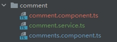
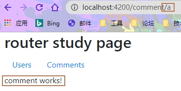
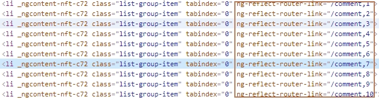
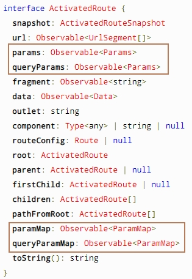
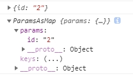
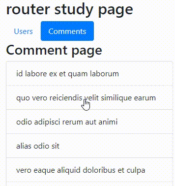
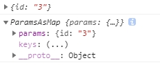
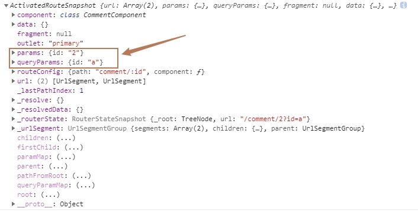
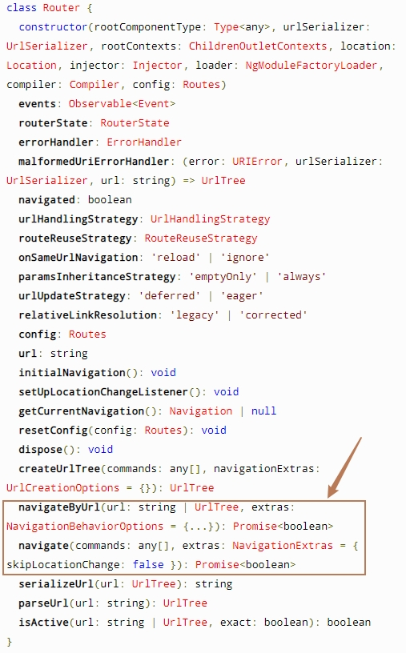

# 路由参数及跳转

> 本节介绍路由参数及跳转相关。

## 准备工作

首先，我们需要将上一节的 ```CommentService``` 、 ```UserService``` 抽离成单独的文件，以便多处使用。

```shell
ng g s components/router-study/comment/comment
```

```shell
ng g s components/router-study/user/user
```

复制上节代码到对应文件：

```typescript
// comment.service.ts
@Injectable()
export class CommentService {
  constructor() { }
  getComments(): Observable<Comment[]> {
    return of(COMMENTS);
  }
  // 根据Id匹配数据
  getComment(id: number | string): Observable<Comment> {
    return this.getComments().pipe(
      map((comments: Comment[]) => comments.find(comment => comment.id === +id))
    );
  }
}
```

<hr>

### 需求分析

1. 点击每条评论跳转评论详情页面；

2. 详情页返回列表页时，高亮显示点击后的评论。

我们将通过**页面链接**及**点击事件**两种方式来实现上述需求。

创建 ```comment``` 组件（注：已将上节创建的评论列表组件 ```comment.component``` 改为 ```comments.component``` ）:

### 创建详情组件

```shell
ng g c components/router-study/comment/comment --flat -t -s -c OnPush
```

tips: ```--flat``` 参数表示直接在comment文件夹下面创建组件，不将文件放在单独的文件夹中。



配置路由：

```typescript
// router-study-routing.module.ts
{path: 'comment/:id', component: CommentComponent}
```



## routerLink

语法： ```routerLink: string | any[]```

上节我们通过添加 ```routerLink``` 属性实现了组件之间的跳转：

```html
<a class="nav-link" routerLink="/comments" routerLinkActive="active">Comments</a>
```

按照这个思路，我们来试一下直接在字符串后面添加 ```id``` :

```typescript
// comments.component.ts
template: `
    <h3>Comment page</h3>
    <ul class="list-group">
      <li
        class="list-group-item"
        [class.active]="item.id === selectedId"
        *ngFor="let item of comments$ | async"
        (click)="onSelected(item.id)"
        [routerLink]="'/comment/' + item.id"
      >
        {{ item.name }}
      </li>
    </ul>
  `,
```

不出意外，这样果然行得通。那 ```routerLink``` 的值是数组呢？

```html
[routerLink]="['/comment', item.id]"
```

页面将会渲染成这样：



点击之后，一样可以实现跳转。我们可以得出下面结论：

- 绑定数组时，会拼接数组的每一项，且中间用’```/```‘分割

### 获取详情数据

首先应该获取到```url```中```id```参数，这里我们就要用到 ```ActivatedRoute``` 这个接口。

** ActivatedRoute: **



从上图可以看出，我们至少可以使用跟 ```params``` 有关的属性，他们都是 ```Observable``` 类型。

在 ```constructor``` 中注入：

```typescript
// comment.component.ts
constructor(private route: ActivatedRoute) { }
```

#### params

打印 ```params``` 、 ```paramMap```:

```typescript
this.route.params.subscribe(res => console.log(res));  
this.route.paramMap.subscribe(res => console.log(res)); 
```



这样就能获得传入的 ```id``` 值，从而获取详情：

```typescript
// comment.component.ts
export class CommentComponent implements OnInit {
  comment$: Observable<Comment>;
  constructor(private route: ActivatedRoute, private commentServer: CommentService) { }

  ngOnInit(): void {
    // 使用params获取id
    // this.comment$ = this.route.params.pipe(
    //   switchMap( params => this.commentServer.getComment(params.id))
    // );

    // 使用paramMap获取id
    this.comment$ = this.route.paramMap.pipe(
      switchMap(paramMap => this.commentServer.getComment(paramMap.get('id')))
    );
  }
}
```

```Map``` 类型的数据需要使用 ```get()``` 获取。

渲染数据：

```html
<div class="card" style="width: 18rem;">
  <div class="card-body" *ngIf="comment$ | async as comment; else noneComment">
    <h5 class="card-title">{{comment.name}}</h5>
    <h6 class="card-subtitle mb-2 text-muted">{{comment.email}}</h6>
    <p class="card-text">{{comment.body}}</p>
    <hr>
    <button class="btn btn-primary" routerLink="/comments">返回</button>
  </div>
</div>
<ng-template #noneComment>没有comment内容</ng-template>
```



上面已经实现基础功能，但是返回的时候并没有高亮上次选择的数据。我们来解决这个问题。

在列表页面要知道上次选择的数据，我们需要将当前 ```id``` 回传。可以用上面介绍的方式，很容易就能做到。但是，这里我们换一种方式传递参数：

```html
<button class="btn btn-primary" [routerLink]="['/comments', {id: comment.id}]">返回</button>
```

返回列表页面时，```URL``` 地址变成了这样的格式： ```http://localhost:4200/comments;id=4``` 。 使用分号 “```;```” 间隔了参数。

同样，我们可以通过 ```params``` 、 ```paramMap``` 获取到 ```id``` :

```typescript
// comments.component.ts
ngOnInit(): void {
    this.comments$ = this.route.params.pipe(
      switchMap(params => {
        this.selectedId = +params.id;
        return this.commentServer.getComments();
      })
    );
    // 或者这样：
    // this.comments$ = this.route.paramMap.pipe(
    //   switchMap(paramsMap => {
    //     this.selectedId = +paramsMap.get('id');
    //     return this.commentServer.getComments();
    //   })
    // );
  }
```

#### queryParams

前面不是还有个 ```queryParams``` 、  ```queryParamMap``` 一直没用吗？ 既然是 ```query``` 开头的属性，那```URL``` 中连接参数的分隔符必然是“```?```”。所以，那就试试吧~

一开始，我试图用字符串拼接的方式传递 ```query``` 参数：

```html
[routerLink]="'/comments?id=' + comment.id"
```

 ```URL``` 会转译成这样： ```http://localhost:4200/comments%3Fid%3D3``` ，导致错误。所以，我们需要另一个输入性属性 ```queryParams``` ：

```html
<button class="btn btn-primary" routerLink="/comments" [queryParams]="{id: comment.id}">返回</button>
```

跳转成功，并能够打印出 ```query``` 参数：



#### snapshot

除了上面两种方式能够获取到 ```URL``` 中的参数，我们还可以使用 ```snapshot``` 。

当我们的 ```URL``` 是这样的格式： ```http://localhost:4200/comment/2?id=a```

打印 ```snapshot``` ：

```typescript
console.log(this.route.snapshot);
```



这样，我们可以同时拿到所需要的 ```params``` 、 ```queryParams``` ，操作简单很多。

## 编程式跳转

除了上面介绍的用 ```routerLink``` 进行跳转，我们还可以使用编程式的跳转。

### Router

一个提供导航和操纵 ```URL``` 能力的 ```NgModule```。



单纯从事件名看来，我们应该可以使用 ```navigateByUrl()``` 、 ```navigate()``` 进行跳转：

#### navigateByUrl()

语法：```navigateByUrl(url: string | UrlTree, extras: NavigationBehaviorOptions): Promise<boolean>```

```typescript
interface UrlTree {
  root: UrlSegmentGroup
  queryParams: Params
  fragment: string | null
  queryParamMap: ParamMap
  toString(): string
}
```

先来个简单的例子：

```html
<h3>Comment page</h3>
<ul class="list-group">
  <li
    class="list-group-item"
    [class.active]="item.id === selectedId"
    *ngFor="let item of comments$ | async"
    (click)="toComment(item.id)"
  >
    {{ item.name }}
  </li>
</ul>
```

```navigateByUrl()``` 是基于所提供的 ```URL``` 进行导航，*** 必须使用绝对路径 ***。

```typescript
// comments.component.ts
toComment(id: number): void {
  this.router.navigateByUrl('/comment/' + id).then(r => console.log(r));
}
```

传递 ```query``` 参数：

```typescript
goBack(id: number) {
  this.router.navigateByUrl('/comments?id=' + id)
}
```

#### navigate() 

语法：``` navigate(commands: any[], extras: NavigationExtras = { skipLocationChange: false }): Promise<boolean>```

导航到相对于当前 ```URL``` 的动态路由路径：

```typescript
// comments.component.ts
toComment(id: number): void {
  this.router.navigate(['/comment', id]).then(r => console.log(r));
}
```

传递 ```query``` 参数：

```typescript
goBack(id: number) {
  this.router.navigate(['comments'], {queryParams: {id}}).then(r => console.log(r));
}
```

## 总结

1. 可以使用 ```routerLink``` 及函数式用方法进行跳转；

2. 两种方式传递 ```query``` 参数都需要使用 ```queryParams``` ；

3. 使用 ```ActivatedRoute.snapshot``` 能够快速获得路由此刻的一系列信息。
