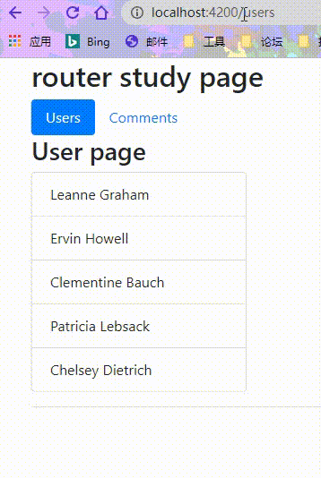

# 路由守卫

> 所谓守卫，不就是把守出入口以控制进出的作用吗？路由守卫也就是掌控用户导航到应用不同场景的手段。

## 多级路由

- 介绍路由守卫前，我们需要简单了解下多级路由，也称子路由。

前面我们已经有了一个用户的列表，这次我们的需求是: 点击每个用户数据，展示详情信息在本页面。

先创建一个 user 组件，用来展示详情信息：

```shell
ng g c components/router-study/user/user -s -t -c OnPush --flat
```

1. 使用 children 配置子路由：

```typescript
// router-study-routing.module.ts
import {UserComponent} from './user/user/user.component';
const routes: Routes = [
  {
    path: 'users',
    component: UsersComponent,
    children: [
      {
        path: ':id',
        component: UserComponent
      }
    ]
  },
];
```

2. users 页面中设置跳转并预留路由插槽（占位符）：

```typescript
// user.component.ts
  template: `
    <h3>User page</h3>
    <ul class="list-group">
      <li
        class="list-group-item"
        [class.active]="item.id === selectedId"
        *ngFor="let item of users$ | async"
        (click)="onSelected(item.id)"
        [routerLink]="[item.id]">
        {{ item.name }}
      </li>
    </ul>
    <hr>
    <router-outlet></router-outlet>
  `
```

3. user 组件中获取数据并渲染：

```typescript
@Component({
  selector: 'app-user',
  template: `
    <div *ngIf="user$ | async as user">
      <h4>{{user.name}}</h4>
      <p><span>{{user.username}}</span> | Email: <span>{{user.email}}</span></p>
    </div>
  `,
  changeDetection: ChangeDetectionStrategy.OnPush
})
export class UserComponent implements OnInit {
  user$: Observable<User>;
  constructor(private userServe: UserService, private route: ActivatedRoute) { }

  ngOnInit(): void {
    this.user$ = this.route.params.pipe(
      switchMap(params => this.userServe.getUser(params.id))
    );
  }
}
```

如此，我们就创建了一个完整的子路由：



### 无组件路由

目前为止，我们每一条路由信息都配置了 ‘component’ 参数，其实， 如果没有配置对应的跳转组件也是可以的。

修改前面的 users 路由：

```typescript
// router-study-routing.module.ts
import {UserComponent} from './user/user/user.component';
const routes: Routes = [
  {
    path: 'users',
    children: [
      {
        path: '',
        component: UsersComponent,
        children: [
          {
            path: ':id',
            component: UserComponent
          }
        ]
      }
    ]
  },
];
```

其实这样配置最后的效果跟以前是没有区别的，目前为止，我所直到这样配置优点是**利于配置路由守卫**。（后面会遇到）

## 命名路由

目前为止，我们所有的路由的出口（outlet）都是一个默认的 outlet 标签，其实，路由可以指定具体某个 outlet 标签为出口。

生成一个 tips 组件作为演示：

```shell
ng g c components/router-study/user/tips -t -s -c OnPush --flat
```


