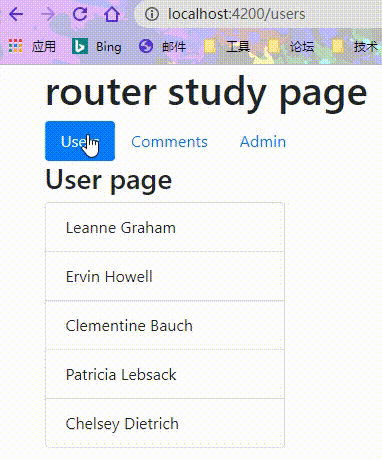
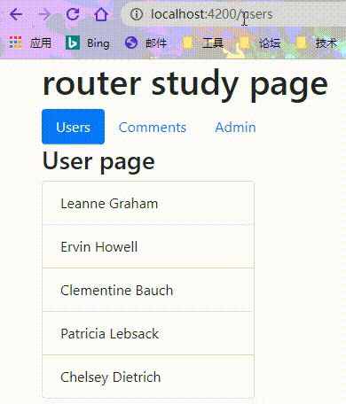
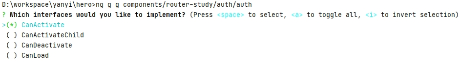
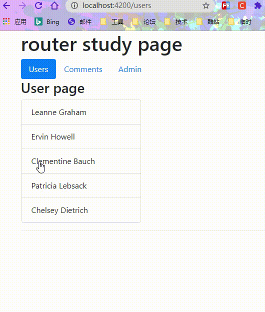
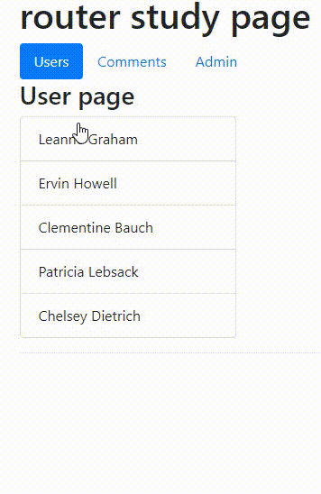
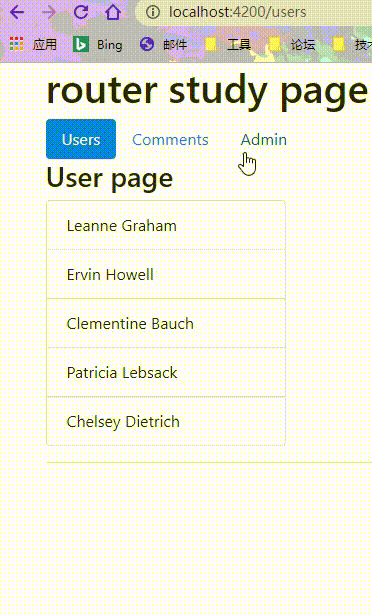

# 路由守卫

> 所谓守卫，不就是把守出入口以控制进出的作用吗？路由守卫也就是掌控用户导航到应用不同场景的手段。

## 简介

到本系列教程目前为止，任何用户都能在任何时候导航到任何地方。但有时候出于种种原因需要控制对该应用的不同部分的访问。可能包括如下场景：

 - 该用户可能无权导航到目标组件或者需要先登录（认证）才能访问；
 - 在显示目标组件前，你可能得先获取某些数据；
 - 在离开组件前，你可能要先保存修改或者根据用户意愿判定是否保持。

你可以往路由配置中添加守卫，来处理这些场景。 守卫返回一个值，以控制路由器的行为：

 - 如果它返回 ```true```，导航过程会继续；
 - 如果它返回 ```false```，导航过程就会终止，且用户留在原地；
 - 如果它返回 ```UrlTree```，则取消当前的导航，并且开始导航到返回的这个 ```UrlTree```。

路由器可以支持多种守卫接口：

 - 用 ```CanActivate``` 来处理导航到某路由的情况；
 - 用 ```CanActivateChild``` 来处理导航到某子路由的情况；
 - 用 ```CanDeactivate``` 来处理从当前路由离开的情况；
 - 用 ```Resolve``` 在路由激活之前获取路由数据；
 - 用 ```CanLoad``` 来处理异步导航到某特性模块的情况。

## CanActivate

```CanActivate``` 守卫是一个管理**需要身份验证**导航类业务规则的工具。

我们将通过一个单独 ```admin``` 模块来演示。如果用户没有登录，是不能进入 ```admin``` 管理界面，自动跳转到登录页面去登录，登录后重定向回 ```admin``` 管理界面。最终结果如下：



### 准备工作

新建 ```admin``` 模块：

```shell
ng g m components/router-study/admin --routing
```

新建 ```admin``` 组件：

```shell
ng g c components/router-study/admin -c OnPush -s
```

新建 ```admin-dashboard``` 组件：

```shell
ng g c components/router-study/admin/admin-dashboard -c OnPush -s
```

新建 ```manage-user``` 组件：

```shell
ng g c components/router-study/admin/manage-user -c OnPush -s
```

在 ```router-study``` 模块中引入 ```admin``` 模块：

```typescript
// router-study.module.ts
imports: [
  ...
  AdminModule
]
```

配置 ```admin``` 路由信息：

```typescript
// admin-routing.module.ts
const routes: Routes = [
  {
    path: 'admin',
    component: AdminComponent,
    children: [
      {
        path: '',
        children: [
          { path: 'user', component: ManageUserComponent },
          { path: '', component: AdminDashboardComponent }
        ]
      }
    ]
  }
];
```

```admin``` 下面有一个无组件路由，它包含了我们创建的两个子路由。并且默认展示的是 ```admin-dashboard``` 组件。

修改 ```admin-dashboard``` 组件模板内容(两个导航链接及一个路由出口)：

```html
<!-- admin.component.html -->
<h2>ADMIN</h2>
<nav>
  <ul class="nav nav-pills">
    <li class="nav-item">
      <a class="nav-link" routerLink="./" routerLinkActive="active" [routerLinkActiveOptions]="{ exact: true }">Dashboard</a>
    </li>
    <li class="nav-item">
      <a class="nav-link" routerLink="./user" routerLinkActive="active">Manage user</a>
    </li>
  </ul>
</nav>
<router-outlet></router-outlet>
```

tips: 上面使用了```routerLinkActiveOptions``` 属性，这是限制 ```routerLinkActive``` 的匹配规则， ```true``` 表示完全匹配。因为上面 ```admin-dashboard``` 组件的路径是空，如不加以限制，任意路径都会添加 ‘```active```’。

给 ```admin``` 模块添加入口：

```typescript
// router-study.component.ts
template: `
    <div class="container">
      <h1>router study page</h1>
      <ul class="nav nav-pills">
        <li class="nav-item">
          <a class="nav-link" routerLink="users" routerLinkActive="active">Users</a>
        </li>
        <li class="nav-item">
          <a class="nav-link" routerLink="/comments" routerLinkActive="active">Comments</a>
        </li>
        <!-- 入口 -->
        <li class="nav-item">
          <a class="nav-link" routerLink="/admin" routerLinkActive="active">Admin</a>
        </li>
      </ul>
      <router-outlet></router-outlet>
    </div>
  `
```

现在，页面效果应该是这样的：



### 添加守卫

我们将添加一个 ```auth``` 模块来专门管理用户认证信息：

```shell
ng g m components/router-study/auth --routing
```

创建守卫：

```shell
ng g g components/router-study/auth/auth
```

tips：```g``` 是 ```guard``` 的简写。

执行上面命令后会让我们选择创建哪个守卫，我们选择 ```CanActivate``` ：



先看生成的 ```auth.guard.ts``` 文件默认代码：

```typescript
// auth.guard.ts
import { Injectable } from '@angular/core';
import { CanActivate, ActivatedRouteSnapshot, RouterStateSnapshot, UrlTree } from '@angular/router';
import { Observable } from 'rxjs';

@Injectable({
  providedIn: 'root'
})
export class AuthGuard implements CanActivate {
  canActivate(
    route: ActivatedRouteSnapshot,
    state: RouterStateSnapshot
  ): Observable<boolean | UrlTree> | Promise<boolean | UrlTree> | boolean | UrlTree {
    return true;
  }
}
```

可以看出：

- 守卫也是一个服务，并且默认从 ‘```root```’ 中提供；
- 返回值可以是三种类型的布尔值或 ```UrlTree``` 。

使用守卫，只需要在路由配置文件中添加 ```CanActivate: [AuthGuard]```：

```typescript
// admin-routing.module.ts
const routes: Routes = [
  {
    path: 'admin',
    component: AdminComponent,
    canActivate: [AuthGuard],
    ...
  }
];
```

此时，因为守卫直接返回了 ```true``` ，所以，同样可以导航到 ```admin``` 组件，并没有什么影响。

显然，我们是需要通过逻辑来判定最后返回的结果，以便控制守卫进行拦截或放行。

新建一个 ```auth``` 服务进行统筹管理登录状态：

```shell
ng g s components/router-study/auth/auth
```

实现 ```auth``` 服务的逻辑：

```typescript
// auth.service.ts
...
export class AuthService {
  // 登陆状态
  isLoggedIn = false;
  // 保存登录后重定向的路径
  redirectUrl: string;

  // 模拟登录
  login(): Observable<boolean> {
    return of(true).pipe(
      delay(1000),
      tap(val => this.isLoggedIn = true)
    );
  }

  logout(): void {
    this.isLoggedIn = false;
  }
}
```

在守卫中应用 ```auth``` 服务：

```typescript
// auth.guard.ts
export class AuthGuard implements CanActivate {
  // 引入服务
  constructor(private authService: AuthService, private router: Router) {}

  canActivate(next: ActivatedRouteSnapshot, state: RouterStateSnapshot): true | UrlTree {
    const url: string = state.url; // 将要跳转的路径
    return this.checkLogin(url);
  }

  private checkLogin(url: string): true | UrlTree {
    // 已经登录，直接返回true
    if (this.authService.isLoggedIn) { return true; }
    // 修改登陆后重定向的地址
    this.authService.redirectUrl = url;
    // 重定向到登录页面
    return this.router.parseUrl('/login');
  }
}
```

新建 ```login``` 组件：

```shell
ng g c components/router-study/auth/login -s -c OnPush
```

修改 ```login``` 模板：

```html
<!-- login.component.html-->
<h3>LOGIN</h3>
<p [class.text-danger]="!authService.isLoggedIn">{{message}}</p>
<p>
  <button class="btn btn-primary" (click)="login()"  *ngIf="!authService.isLoggedIn">登录</button>
  <button class="btn btn-danger" (click)="logout()" *ngIf="authService.isLoggedIn">退出登录</button>
</p>
```

添加登录逻辑：

```typescript
// login.component.ts
...
export class LoginComponent {
  message: string;
  constructor(public authService: AuthService, public router: Router) {
    this.setMessage();
  }
  setMessage() {
    this.message = this.authService.isLoggedIn ? '已经登录~' : '没有登录！';
  }
  login() {
    this.message = '登录中 ...';
    this.authService.login().subscribe(() => {
      this.setMessage();
      if (this.authService.isLoggedIn) {
        const redirectUrl = this.authService.redirectUrl || '/admin'; // 防止用户直接在地址栏输入造成的redirectUrl为空的错误
        // 跳转回重定向路径
        this.router.navigate([redirectUrl]);
      }
    });
  }
  logout() {
    this.authService.logout();
    this.setMessage();
    this.router.navigate(['/']);
  }
}
```

添加 ```login``` 路由：

```typescript
// auth-routing.module.ts
const routes: Routes = [
  {path: '/login', component: LoginComponent}
];
```

在 ```router-study``` 模块中引入 ```auth``` 模块：

```typescript
// router-study.module.ts
imports: [
  ...
  AdminModule,
  AuthModule
]
```

至此，我们 ```CanActivate``` 守卫的逻辑全部完成。


## CanActivateChild

```CanActivateChild``` 守卫跟 ```CanActivate``` 守卫类似。只不过是用来保护子路由。它们的区别在于，```CanActivateChild``` 会在**任何子路由**被激活之前运行。

在 ```auth.guard``` 中实现 ```CanActivateChild``` 守卫：

```typescript
// auth.guard.ts
export class AuthGuard implements CanActivate, CanActivateChild {
  constructor(private authService: AuthService, private router: Router) {}
  
  canActivateChild(next: ActivatedRouteSnapshot, state: RouterStateSnapshot): true | UrlTree {
    // 直接复用前面的逻辑
    return this.canActivate(next, state);
  }
  // ...
}
```

只能在子路由中使用守卫：

```typescript
// admin-routing.module.ts
const routes: Routes = [
  {
    path: 'admin',
    component: AdminComponent,
    children: [
      {
        path: '',
        canActivateChild: [AuthGuard],
        children: [
          { path: 'user', component: ManageUserComponent },
          { path: '', component: AdminDashboardComponent }
        ]
      }
    ]
  }
];
```

其实这样我们是拦截了整个子路由，跟前面的效果是一样的。如果还想拦截进一步的 ```manage-user``` ,那需要创建一个无组件路由来包裹 ```manage-user``` ：

```typescript
// admin-routing.module.ts
const routes: Routes = [
  {
    path: 'admin',
    component: AdminComponent,
    children: [
      {
        path: '',
        children: [
          {
            path: 'user',
            canActivateChild: [AuthGuard],
            children: [
              {path: '', component: ManageUserComponent}
            ]
          },
          { path: '', component: AdminDashboardComponent }
        ]
      }
    ]
  }
];
```


## CanDeactivate

前面两个守卫都是拦截进入某个路由， ```CanDeactivate``` 守卫则是拦截跳出路由。

我们将通过修改 ```user``` 详情来做示例。

没有修改的情况下：点‘保存’，则正常保存退出，点‘取消’，就不保存退出；

有变动的情况下：点‘保存’，则正常保存退出，点‘取消’，根据弹出询问框用户选择结果退出。

最终效果如下：



### 准备工作

修改原来的 ```user``` 组件：

```typescript
// user.component.ts
...
template: `
    <div *ngIf="user">
      <h4>{{user.name}}</h4>
      <div class="form-group row">
        <label for="staticEmail" class="col-sm-1 col-form-label">Email:</label>
        <div class="col-sm-10">
          <input type="text" class="" id="staticEmail" [(ngModel)]="editEmail" placeholder="email...">
        </div>
      </div>
      <div class="btn btn-group">
        <button class="btn btn-secondary" (click)="save()">保存</button>
        <button class="btn btn-danger" (click)="cancel()">取消</button>
      </div>
    </div>
  `
...
export class UserComponent implements OnInit {
  user: User; // 这里不使用Observable
  editEmail: string; // 保存初始email值
  constructor(
    private userServe: UserService,
    private route: ActivatedRoute,
    private cdr: ChangeDetectorRef,
    private router: Router
  ) { }

  ngOnInit(): void {
    this.route.params.pipe(
      switchMap(params => this.userServe.getUser(params.id))
    ).subscribe(res => {
      this.user = res;
      this.editEmail = res.email;
      // 标记需要被变更检测
      this.cdr.markForCheck();
    });
  }
  save(): void {
    this.user.email = this.editEmail;
    this.goBack();
  }
  cancel(): void {
    this.goBack();
  }
  private goBack(): void {
    this.router.navigate(['../'], {relativeTo: this.route});
  }
}
```

现在页面表现是这样的：



### 实现守卫

首先生成一个 ```Dialog``` 服务，来处理用户的确认操作：

```shell
ng g s components/router-study/user/dialog
```

服务里面添加一个 ```confirm``` 方法：

```typescript
// dialog.service.ts
...
export class DialogService {
  confirm(message?: string): Observable<boolean> {
    const confirmation = confirm(message || 'Is it OK?');
    return of(confirmation);
  }
}
```

```user``` 下创建一个 ```can-deactivate``` 守卫：

```shell
ng g g components/router-study/user/can-deactivate
```

修改里面的逻辑：

```typescript
// can-deactivate.guard.ts
...
// 声明一个包含canDeactivate方法的接口
export interface CanComponentDeactivate {
  canDeactivate: () => Observable<boolean> | Promise<boolean> | boolean;
}
export class CanDeactivateGuard implements CanDeactivate<CanComponentDeactivate> {
  // 将组件作为参数传入
  canDeactivate(component: CanComponentDeactivate): Observable<boolean> | Promise<boolean> | boolean {
    // 判读传入的组件是否存在canDeactivate方法，如果存在，则返回执行结果
    return  component?.canDeactivate();
  }
}
```

守卫不需要知道哪个组件有 ```deactivate``` 方法，它可以检测 ```UserComponent``` 组件有没有 ```CanDeactivate()``` 方法并调用它。

使用守卫：

```typescript
// router-study-routing.module.ts
const routes: Routes = [
  ...
  {
    path: 'users',
    children: [
      {
        path: '',
        component: UsersComponent,
        children: [
          {
            path: ':id',
            component: UserComponent,
            canDeactivate: [CanDeactivateGuard]
          }
        ]
      }
    ]
  },
];
```

此时，因为 ```UserComponent``` 组件中没有 ```CanDeactivate``` 方法，所以并不会拦截路由跳出。

给 ```UserComponent``` 组件添加 ```CanDeactivate``` 方法：

```typescript
// user.component.ts
...
 canDeactivate(): Observable<boolean> | boolean {
  if (!this.user || this.user.email === this.editEmail) {
    return true;
  }
  return this.dialogService.confirm('放弃保存？');
}
```

到这里，我们想要的效果全部实现。

## Resolve

```Resolve``` 守卫用来预先获取组件数据。

通常情况下，我们从服务器获取数据都会有一定延迟，这样就会导致页面第一时间拿不到数据，导致无法显示。 ```Resolve``` 守卫就可以解决这一痛点。

在 ```user``` 组件下新建一个 ```user-resolve``` 服务，用来获取 ```users``` 数据：

```shell
ng g s components/router-study/user/user-resolve
```

实现 ```Resolve``` 守卫：

```typescript
// user-resolve.service.ts
...
// 引入Resolve接口
export class UserResolveService implements Resolve<User>{
  constructor(private userServe: UserService, private router: Router) { }
  // 实现对应方法
  resolve(route: ActivatedRouteSnapshot, state: RouterStateSnapshot): Observable<User> | Promise<User> | User | Observable<never> {
    return this.userServe.getUser(route.paramMap.get('id')).pipe(
      first(), // 让流变成可结束流
      mergeMap(user => {
        if (user) {
          return of(user);
        } else { // 没有找到数据
          this.router.navigateByUrl('/');
          return EMPTY; // 返回EMPTY，就不能进入到下一级路由
        }
      })
    );
  }
}
```

使用守卫，路由中配置 ```Resolve``` ：

```typescript
// router-study-routing.module.ts
...
  {
    path: 'users', 
    children: [
      {
        path: '',
        component: UsersComponent,
        children: [
          {
            path: ':id',
            component: UserComponent,
            canDeactivate: [CanDeactivateGuard],
            resolve: {
              user: UserResolveService
            }
          }
        ]
      }
    ]
  }
```

```user``` 组件中修改获取数据方式：

```typescript
// user.component.ts
...
ngOnInit(): void {
  this.route.data.subscribe((data: { user: User }) => {
    this.user = data.user;
    this.editEmail = data.user.email;
    this.cdr.markForCheck();
  });
}
...
```

tips: ```this.route.data``` 可以获取到路由配置中所有自定义的属性。

这样我们就实现了 ```Resolve``` 守卫全部的功能，因为我们获取本地数据的速度足够快，所以页面显示效果并没有差异。

下图演示下如果找不到数据，页面会拦截进入详情路由，并跳转首页：



## 总结

1. ```CanActivate``` 、 ```CanActivateChild``` 守卫拦截进入路由，可以进行鉴权相关判定；

2. ```CanDeactivate``` 守卫拦截退出路由，可以处理未保存的更改；

3. ```Resolve``` 守卫用来预先获取组件数据。


