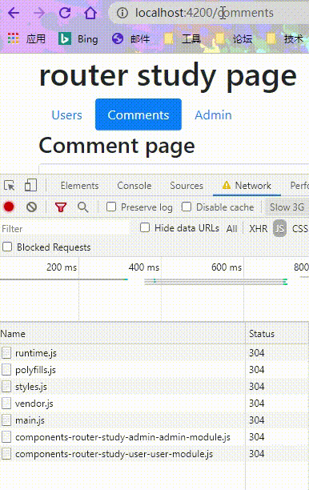

# 异步路由

> 在日常的开发中，我们的程序可能有很多模块，如果我们还是按照在打开程序时就全部加载所有内容的常规方式，就会出现加载缓慢的问题。使用异步路由，就能解决这个问题。

## 懒加载路由

顾名思义，懒加载就是最初不加载，在需要的时候才加载组件。

我们将改造前面的 ```admin``` 组件为懒加载模式。实现方式也很简单，只需要简单的三步：

1. 将原来的 ```admin-routing``` 中 ```admin``` 配置的 ```path``` 设为空(```''```):

```json
// admin-routing.module.ts
{
  path: '', 
  component: AdminComponent,
  ...
}
```

2. 在引入 ```admin``` 模块的**任意父级模块**的路由配置文件中配置懒加载：

```typescript
// app-routing.module.ts
const routes: Routes = [
  {
    path: 'admin',
    loadChildren: () => import('./components/router-study/admin/admin.module').then(m => m.AdminModule),
  },
  ...
];
```

3. 在原来引入 ```AdminModule``` 的模块中删除：


这样，就实现了 ```admin``` 组件的懒加载：


### CanLoad 守卫

前面我们已经使用 ```CanActivate``` 守卫来拦截未登录的用户进入 ```admin``` 模块，并且也添加了路由懒加载来动态添加组件。但是，如果用户没有登录，想要进入 ```admin``` 模块，程序还是会加载 ```AdminModule```。最理想的情况应该是这样的：**用户只有在已经登录的情况下进入 ```admin``` 模块时才加载 ```AdminModule```**。

顾名思义， ```CanLoad``` 守卫就是**能不能加载**的意思，所以，我们用它来实现上面的需求。

借用前面的 ```auth.guard``` ,我们来实现 ```CanLoad``` 守卫：

```typescript
// auth.guard.ts
export class AuthGuard implements CanActivate, CanActivateChild, CanLoad {
  // ...
  canLoad(route: Route, segments: UrlSegment[]): Observable<boolean | UrlTree> | Promise<boolean | UrlTree> | boolean | UrlTree {
    const url = `/${route.path}`;
    return this.checkLogin(url);
  }
  private checkLogin(url: string): true | UrlTree {
    // 已经登录，直接返回true
    if (this.authService.isLoggedIn) { return true; }
    // 修改登陆后重定向的地址
    this.authService.redirectUrl = url;
    // 重定向到登录页面
    return this.router.parseUrl('/login');
  }
}
```

我们判定能不能加载模块的逻辑依旧是用户有没有登录。

在设置懒加载路由的地方使用守卫：

```typescript
// app-routing.module.ts
const routes: Routes = [
  {
    path: 'admin',
    loadChildren: () => import('./components/router-study/admin/admin.module').then(m => m.AdminModule),
    canLoad: [AuthGuard]
  }
  // ...
];
```

当用户没有登陆时，进入 ```admin``` 模块是不会加载 ```AdminModule``` ，只有登录了才加载：


## 预加载

预加载是指在程序加载完必要资源后，空闲时段预先加载其他资源。懒加载路由一般用于使用频率较低的组件，而预加载则用于使用频率较高的组件。

 ```angular``` 本身提供了两种预加载策略：**完全不预加载**，这是默认值，以及**预加载所有异步路由**。当然，也支持自定义预加载策略。

** 补救 **

由于前面的不规范操作，```comment``` 组件没有成为一个单独的模块，为了后面的演示，我们需要把它分成单独的一个模块。

```shell
ng g m  components/router-study/comment
```

并将原来有关 ```comment``` 的配置放在 ```comment.mudule``` 里：

```typescript
// comment.mudule.ts
...
@NgModule({
  declarations: [CommentsComponent, CommentComponent],
  imports: [CommonModule],
  providers: [CommentService]
})
...
```
这样 ```comment``` 就抽离成一个单独的模块了。同样的将 ```user``` 也抽离成一个单独的模块，就不演示了。

按照前面的三步将 ```comment``` 模块配置成异步加载形式：

```typescript
// app-routing.module.ts
const routes: Routes = [
  {
    path: 'comments',
    loadChildren: () => import('./components/router-study/comment/comment.module').then(m => m.CommentModule)
  },
  // ...
];
```

将程序设置成预加载所有异步路由策略。

```RouterModule.forRoot()``` 方法的第二个参数接受一个附加配置选项对象。 把 ```PreloadAllModules``` 添加到 ```forRoot()``` 调用中：

```typescript
// app-routing.module.ts
@NgModule({
  imports: [RouterModule.forRoot(routes, {preloadingStrategy: PreloadAllModules})],
  ...
})
```

我们将浏览器的调试工具设置成 'Slow 3G' 网速，以便能够看到明显的效果：


可以看出，当我们加载完当前页面必需的资源后，最后加载了 ```CommentModule``` 。但是，为什么没有加载同样是异步加载的 ```AdminModule``` 呢？因为 ```CanLoad``` 守卫会阻塞预加载， ```CanLoad``` 守卫的优先级高于预加载策略。

### 自定义预加载策略

预加载全部的异步路由未免太过于激进了，按照我们的意愿来进行预加载才是正确的解决方式。我们可以在路由配置中设定一个 ```preload``` 标识符来判定路由是否需要预加载。

在全局生成一个新的 ```SelectivePreloadingStrategy``` 服务：

```shell
ng g s services/SelectivePreloadingStrategy
```

在生成的文件需要实现 ```PreloadingStrategy``` 接口以及对应的 ```preload()``` 方法：

```typescript
// selective-preloading-strategy.service.ts
export class SelectivePreloadingStrategyService implements PreloadingStrategy {
  // 记录预加载的模块
  preloadedModules: string[] = [];
  preload(route: Route, load: () => Observable<any>): Observable<any> {
    if (route.data && route.data.preload) { // 使用预加载的条件
      this.preloadedModules.push(route.path);
      // 最重要的就是返回这个方法
      return load();
    } else {
      return of(null);
    }
  }
}
```

修改预加载策略为我们自定义的这个：

```typescript
// app-routing.module.ts
@NgModule({
  imports: [RouterModule.forRoot(routes, {preloadingStrategy: SelectivePreloadingStrategyService})],
  ...
})
```

给我们需要的预加载的路由配置 ```preload``` 标识符：

```typescript
// app-routing.module.ts
const routes: Routes = [
  {
    path: 'admin',
    loadChildren: () => import('./components/router-study/admin/admin.module').then(m => m.AdminModule),
    // canLoad: [AuthGuard],
    data: {preload: true}
  }
  // ...
];
```

**注意：** 当我将 ```comment``` 路由也添加预加载后，发现程序会一直重复执行自定义策略里面的 ```load()``` 方法，导致程序出错。具体原因目前未知，等找到解决方法后再进行告知。

所以，我将默认路由改成了 ```comment``` 路由，对 ```user``` 路由进行预加载，程序运行正常。



如果你想在程序中获取有哪些路由启用预加载，也可以通过服务的方式获取到。

我们将 ```SelectivePreloadingStrategyService``` 服务注入到 ```AppRoutingModule``` 的 ```providers``` 数组中，以便它可以注入到应用中的任何地方:

```typescript
// app-routing.module.ts
@NgModule({
  providers: [SelectivePreloadingStrategyService],
  ...
})
```

在任意组件中获取：

```typescript
export class AdminDashboardComponent implements OnInit {
  constructor(private preloadStrategy: SelectivePreloadingStrategyService) { }
  ngOnInit(): void {
    console.log(this.preloadStrategy.preloadedModules); // ["admin", "users"]
  }
}
```

并且会在任意地方打印出日志，不管你有没有进入到调用打印的组件里！

## 路由事件

 ```Router``` 在**每次**导航过程中都会通过 ```Router.events``` 属性发出导航事件。这些事件的范围贯穿从导航开始和结束之间的多个时间点。导航事件的完整列表如下图所示：


任意组件中均可获取事件：

```typescript
 constructor(private router: Router) {
    this.router.events
      .pipe(filter(events => events instanceof NavigationStart))
      .subscribe((event: NavigationStart) => console.log(event));
  }
```

## 总结

1. 实现异步路由分三步：
 
 - 修改原路由配置文件 ```path``` 为空；
 - 删除原加载模块的引用；
 - 父级或顶层模块动态引入。

2. ```CanLoad``` 守卫用于拦截异步路由，优先级高于预加载策略；

3. 懒加载一般适用于使用频率较低的路由，而预加载则相反；

4. 路由事件类似于生命周期，贯穿每次路由导航。

<hr>

到此为止，我们介绍了大部分路由相关的知识，后续我们将介绍表单相关，敬请期待~
