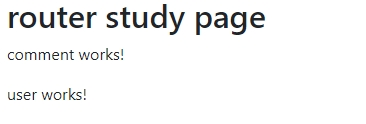

# angular 路由-1.0 初体验

> 任何一个前端框架，页面路由是绕不过的话题。从现在开始，介绍 angular 路由。

## 准备工作

为了更形象的演示，我们先模拟一些数据。

在 ```src/app``` 下创建一个 ```data``` 文件夹储存数据。

```typescript
// src/app/data/data.type.ts
export interface Comment{
  postId: number;
  id: number;
  name: string;
  email: string;
  body: string;
}
export interface User {
  id: number;
  name: string;
  username: string;
  email: string;
}
```

```typescript
// src/app/data/data.ts
import { Comment, User } from './data.type';
// 数据来自http://jsonplaceholder.typicode.com/comments
export const Data: Comment[] = [
  {
    postId: 1,
    id: 1,
    name: 'id labore ex et quam laborum',
    email: 'Eliseo@gardner.biz',
    body: 'laudantium enim quasi est quidem magnam voluptate ipsam eos\ntempora quo necessitatibus\ndolor quam autem quasi\nreiciendis et nam sapiente accusantium'
  }
  ...
]
// 数据来自http://jsonplaceholder.typicode.com/users
export const USERS: User[] = [
  {
    id: 1,
    name: 'Leanne Graham',
    username: 'Bret',
    email: 'Sincere@april.biz'
  }
  ...
]
```

创建一个 ```router-study``` 模块， ```--routing``` 表示生成相应的路由配置文件（```xxx.routing.module.ts```）：

```shell
ng g m components/router-study --routing
```

在 ```app.module.ts``` 中配置 ```router-study``` 模块：

```typescript
// app.module.ts
...
@NgModule({
  declarations: [
    AppComponent
  ],
  imports: [
    BrowserModule,
    RouterStudyModule,
    AppRoutingModule
  ],
  bootstrap: [AppComponent]
})
```

这里注意：```RouterStudyModule``` 应该放在 ```AppRoutingModul```e 前面。因为我们会在 ```AppRoutingModule``` 中配置设置通配符路由，不然可能会出现拦截路由的问题。

依次创建4个组件：

```shell
ng g c components/router-study -s -t -c OnPush
```

```shell
ng g c components/router-study/comment -s -t -c OnPush
```

```shell
ng g c components/router-study/user -s -t -c OnPush
```

```shell
ng g c components/not-found -s -t -c OnPush
```

在 ```router-study``` 中调用 ```comment``` 、 ```user``` 组件：

```typescript
// router-study.component.ts
template: `
    <div class="container">
      <h2>router study page</h2>
      <app-comment></app-comment>
      <app-user></app-user>
    </div>
  `
```

在 ```app``` 组件中调用 ```router-study``` ：

```html
<!--app.component.html-->
<app-router-study></app-router-study>
```

请确保程序能正常运行，页面上能看到 ```comment``` 、 ```user``` 组件内容。



## 配置路由

我们想要的结果应该是这样的：页面上有两个链接，点击后能展示不同页面的内容。要实现，需要有以下两步操作：

1. 把 ```RouterModule``` 和 ```Routes``` 导入到你的路由模块中。

这一步实际上在我们创建  ```router-study``` 模块时 ```cli``` 工具已经自动导入：

```typescript
// router-study-routing.module.ts 自动生成内容：
import { NgModule } from '@angular/core';
import { Routes, RouterModule } from '@angular/router';
import {UsersComponent} from './user/user.component';
import {CommentsComponent} from './comment/comment.component';

const routes: Routes = [];

@NgModule({
  imports: [RouterModule.forChild(routes)],
  exports: [RouterModule]
})
export class RouterStudyRoutingModule { }
```

上面代码很容易理解，我们只需要将路由信息配置到 ```routes``` 数组中就行。

```typescript
const routes: Routes = [
  {path: 'comment', component: CommentsComponent},
  {path: 'user', component: UsersComponent},
];
```

一个基础路由，只需要上面两项配置，当然， ```Routes``` 还有更多配置项。   

2. 在页面中使用路由

```typescript
// router-study.module.ts
template: `
  <div class="container">
    <h2>router study page</h2>
    <ul class="nav nav-pills">
      <li class="nav-item">
        <a class="nav-link" routerLink="user" routerLinkActive="active">Users</a>
      </li>
      <li class="nav-item">
        <a class="nav-link" routerLink="/comment" routerLinkActive="active">Data</a>
      </li>
    </ul>
    <router-outlet></router-outlet>
  </div>
  `,
```

- ```routerLink``` 配置跳转路径，相对路径、绝对路径都可；

- ```routerLinkActive``` ：当前a标签激活状态时所添加的class样式名（也就是点击所添加的class）。

- ```router-outlet``` ：占位元素，展示所激活路由内容。


tips: 上面这一切请确保项目中```index.html``` 头部中有 ```<base href="/">``` 。如果你是用```cli``` 工具自动生成的项目则无需考虑，会自动添加。

### 设置通配符路由

- 当用户打开页面，我们想要直接显示 users 组件的内容，所以需要配置重定向路由。

- 当用户试图导航到那些不存在的页面时，我们应该让程序处理跳转到404页面，所以需要配置通配符路由。

```typescript
// app-routing.module.ts
...
const routes: Routes = [
  {path: '', redirectTo: '/users', pathMatch: 'full'},
  {path: '**', component: NotFoundComponent }
];
@NgModule({
  imports: [RouterModule.forRoot(routes)],
  exports: [RouterModule]
})
...
```

因为 ```Router``` 在匹配路由时使用“先到先得”策略，所以有明确路径的路由因该放在前面，否则会直接走到通配符路由而不能到达期望路由。这也是将 ```RouterStudyModule``` 放在 ```AppRoutingModule``` 之前的原因。

- ```redirectTo``` ：重定向路径。以此达到默认显示```user```组件内容的目的。

- ```pathMatch``` : 路径匹配策略，为 “```prefix```” 或 “```full```” 之一。默认为“```prefix```”。

  默认情况下，路由器会从左边开始检查 ```URL``` 中的各个元素，以查看此 URL 是否匹配给定的路径，遇到任何一个匹配的，就停止。比如，'```/team/11/user```' 能匹配 '```team/:id```'。

  “```full```” 表示与整个 ```URL``` 匹配。重定向空路径路由时，执行此操作很重要。否则，因为空路径是任何 ```URL``` 的前缀，所以路由器即使在导航到重定向目标时也会进行重定向，从而造成无限循环。


至此，我们已经完成了一个路由基本的配置。
<hr>

## 组件添加数据

为了后面的演示，我们给两个组件添加一些数据。（基本操作，没什么技术含量）

```typescript
// comments.component.ts
import {Component, OnInit, ChangeDetectionStrategy, Injectable} from '@angular/core';
import {Observable, of} from 'rxjs';
import {COMMENTS} from '../../../data/data';
import {Comment} from '../../../data/data.type';
import {map} from 'rxjs/operators';
// 注册获取数据的服务
@Injectable()
class CommentService {
  getComments(): Observable<Comment[]> {
    return of(COMMENTS);
  }
  // 根据Id匹配数据
  getComment(id: number | string): Observable<Comment> {
    return this.getComments().pipe(
      map((comments: Comment[]) => comments.find(comment => comment.id === +id))
    );
  }
}
@Component({
  selector: 'app-comment',
  template: `
    <h3>Comment page</h3>
    <ul class="list-group">
      <li
        class="list-group-item"
        [class.active]="item.id === selectedId"
        *ngFor="let item of comments$ | async"
        (click)="onSelected(item.id)">
        {{ item.name }}
      </li>
    </ul>
  `,
  styles: [`
    .list-group{width: 340px;}
    .list-group-item{cursor: pointer;}
  `],
  changeDetection: ChangeDetectionStrategy.OnPush,
  providers: [CommentService]
})
export class CommentsComponent implements OnInit {
  comments$: Observable<Comment[]>;
  selectedId: number;
  constructor(private commentServer: CommentService) { }

  ngOnInit(): void {
    // 直接获取Observable
    this.comments$ = this.commentServer.getComments();
  }
  onSelected(id: number): void {
    this.selectedId = id;
  }
}
```

```user``` 组件同理

### async pipe

```async``` 管道会订阅一个 ```Observable 或 ```Promise```，并返回它发出的最近一个值。

上面我们直接获取了 ```Observable<Comment[]>``` ，没有因为我们的数据足够简单，且不需要转换就可以使用，所以在模板中使用 ```async``` 管道进行订阅之后就可以像普通变量使用。


## 总结

1. 为了项目结构优化，建议 ```app-routing``` 中仅提供需要全局作用的配置，其他路由在各自 ```routing``` 文件中配置；

2. 重定向路由，需要将路由匹配策略设为' ```full``` '；

3.  ```angular``` 中路由占位符是 ```router-outlet``` 标签；

4. ```async``` 管道可以订阅一个 ```Observable``` ，从而简化代码。
