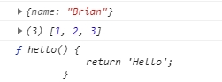
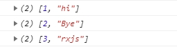
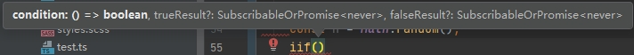
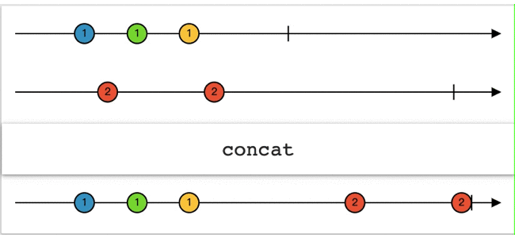
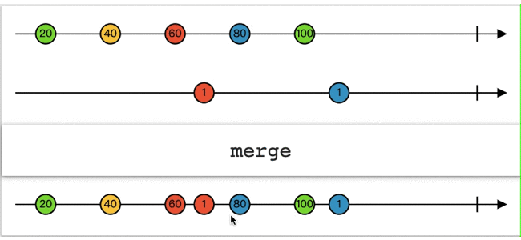
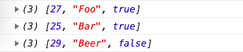

# rxjs-操作符

> 操作符是 ```observables``` 背后的马力，为复杂的异步任务提供了一种优雅的声明式解决方案。

```rxjs```有八种类型的操作符，分别是：组合、条件、创建、错误处理、多播、过滤、转换、工具。我们将通过多节内容来介绍全部常用的操作符。（参考文档：https://rxjs-cn.github.io/learn-rxjs-operators/operators/）

tips:通常情况下，我们是不会通过new Observable() 形式去创建一个可观察对象的，都是使用操作符来创建。

## 创建类型操作符

这些运算符几乎允许你基于任何东西来创建一个 ```observable``` 。

### of 

按顺序发出任意类型和数量的值。

创建简单类型流：

```typescript
import { of } from 'rxjs';
const source$ = of(1, 2, 3, 4, 5);
source$.subscribe(val => console.log(val)); // 输出: 1,2,3,4,5
```

创建复杂类型的流：

```typescript
import { of } from 'rxjs';
const source$ = of({ name: 'Brian' }, [1, 2, 3], function hello() {
  return 'Hello';
});
const subscribe = source$.subscribe(val => console.log(val));
```



### from

将数组、 ```promise``` 或迭代器转换成 ```observable``` 。

转数组：

```typescript
import { from } from 'rxjs';
const arraySource$ = from([1, 2, 3, 4, 5]);
// 输出: 1,2,3,4,5
const subscribe = arraySource$.subscribe(val => console.log(val));
```

转 ```Promise``` :

```typescript
import { from } from 'rxjs';
const promiseSource$ = from(new Promise(resolve => resolve('Hello World!')));
// 输出: 'Hello World'
const subscribe = promiseSource$.subscribe(val => console.log(val));
```

转 ```Map``` 对象:

```typescript
import { from } from 'rxjs';
const map = new Map([
  [1, 'hi']
]);
map.set(2, 'Bye');
map.set(3, 'rxjs');
const mapSource$ = from(map);
const subscribe = mapSource$.subscribe(val => console.log(val));
```



转字符串:

```typescript
import { from } from 'rxjs';
// 将字符串作为字符序列发出,空格也同样输出
const source$ = from('Hello World');
// 输出: 'H','e','l','l','o',' ','W','o','r','l','d'
source$.subscribe(val => console.log(val));
```

### fromEvent

将事件转换成 observable

```typescript
import { fromEvent } from 'rxjs';
import { map } from 'rxjs/operators';

// 创建发出点击事件的 observable
const event$ = fromEvent(document, 'click');
// 先将数据处理一下（获取点击事件发生时的时间戳）
const example = event$.pipe(
  map(event => `Event time: ${event.timeStamp}`)
);
example.subscribe(val => console.log(val));
```

### interval

跟原生类似，基于给定时间间隔发出数字序列。

```typescript
import { interval } from 'rxjs';
// 每1秒发出数字序列中的值
const source$ = interval(1000);
// 数字: 0,1,2,3,4,5....
const subscribe = source$.subscribe(val => console.log(val));
```

### timer

给定持续时间后，再按照指定间隔时间依次发出数字。

```typescript
import { timer } from 'rxjs';
// 1秒后发出0，然后结束
const source$ = timer(1000);
// 输出: 0
const subscribe = source$.subscribe(val => console.log(val));
```

```typescript
import { timer } from 'rxjs';
// 1秒后发出一个值0，然后每两秒继续发出值
const source$ = timer(1000, 2000);
// 输出: 0,1,2,3,4,5......
const subscribe = source$.subscribe(val => console.log(val));
```

### range

依次发出给定区间内的**数字**

```typescript
import { range } from 'rxjs';
// 从2开始，发出5个数字
const numbers$ = range(2, 5);
// 输出: 2 3 4 5 6
numbers$.subscribe(x => console.log(x));
```

```typescript
import { range } from 'rxjs';
// 从0开始，发出4个数字
const numbers$ = range(4);
// 输出: 0 1 2 3
numbers$.subscribe(x => console.log(x));
```

### iif

在被订阅时，根据条件决定, 哪个 ```Observable``` 将被订阅。我们可以看下编辑器对于 ```iff``` 的提示，它可以说明 ```iff``` 所需的参数：



```typescript
import { iif } from 'rxjs';
const n = Math.random();
const iff$ = iif(
  () => n > 0.5, /* 判断条件 */
  of('随机数大于0.5'), /* 满足条件，将推送这条流 */
  of('随机数小于0.5') /* 反之，推送这条 */
);
iff$.subscribe(res => console.log(res));
```

## 组合操作符

组合操作符允许连接来自多个 ```observables``` 的信息。（图形示范：https://rxmarbles.com/）

### concat

类似数组的 ```concat``` ，将每个 ```Observable``` 拼接起来，按顺序发出值，前一个流不执行完后面的流不执行。



```typescript
import {interval, range, concat} from 'rxjs';
import {take} from 'rxjs/operators';
const interval$ = interval(1000).pipe(
  delay(3000),
  // take(4) 只取流的前4个值
  take(4)
);
const sequence$ = range(1, 3);
const result = concat(interval$, sequence$);
// 延迟3秒后依次打印出0 1 2 3 1 2 3
result.subscribe(x => console.log(x));
```

### concatAll

高阶转低阶，按顺序订阅每一个 ```Observable``` 。

tips：高阶的 ```Observable``` ，一个 ```Observable``` 中还嵌套着其它 ```Observable```

```typescript
import { fromEvent, interval } from 'rxjs';
import { map, take, concatAll } from 'rxjs/operators';
const clicks$ = fromEvent(document, 'click');
const higherOrder$ = clicks$.pipe(
  map(ev => interval(1000).pipe(take(2)))
);
// 下面输出由interval创建出来的observable
higherOrder$.subscribe(res => console.log(res));
// 合并
const firstOrder$ = higherOrder$.pipe(concatAll());
// 没点击一次页面，将每隔一秒输出0 1
firstOrder$.subscribe(x => console.log(x));
```

### merge

将多个 ```Observable``` 合并，与 ```concat``` 的行为不同， ```merge``` 是把值按发射的顺序，逐个进行融合。



```typescript
import { merge, fromEvent, interval } from 'rxjs';

const clicks$ = fromEvent(document, 'click');
const interval$ = interval(1000);
const merged$ = merge(clicks$, interval$);
// 定时器一直从0开始持续输出，没点击一次输出fromEvent创建的流
merged$.subscribe(res => console.log(res));
```

设置最多合并几个 ```Observable``` 。

```typescript
// mapTo('a') 将结果转化为'a'
const interval1$ = interval(1000).pipe(take(10), mapTo('a'));
const interval2$ = interval(2000).pipe(take(6), mapTo('b'));
const interval3$ = interval(500).pipe(take(10), mapTo('c'));
// 最后一个参数设为2，表示不管合并了多少个流，最多也只能merge其中的两个（与参数顺序无关）
const merged$ = merge(interval1$, interval2$, interval3$, 2);
merged$.subscribe(x => console.log(x));
```

### mergeAll

```typescript
import { fromEvent, interval } from 'rxjs';
import { map, mergeAll } from 'rxjs/operators';

const clicks$ = fromEvent(document, 'click');
const higherOrder$ = clicks$.pipe(map((ev) => interval(1000)));
const firstOrder$ = higherOrder$.pipe(mergeAll());
// 每点一次，就会发送一个interval创建的流，点的次数越多，创建的流也就越多
firstOrder$.subscribe(x => console.log(x));
```

### forkJoin

类似 ```Promise.all``` , 等每个 ```Observables``` 都完成后，合并它们发出的最后一个值。

```typescript
import { forkJoin, of, timer } from 'rxjs';

const observable = forkJoin([
  of(1, 2, 3, 4),
  Promise.resolve(8),
  timer(4000),
]);
/**
 * 输出：
 * [4, 8, 0]
 * 'This is how it ends!'
 * **/
observable.subscribe({
 next: value => console.log(value),
 complete: () => console.log('This is how it ends!'),
});
```

### partition

将一个 ```Observable``` 按条件分成两个。

```typescript
const observableValues = of(1, 2, 3, 4, 5, 6);
const [evens$, odds$] = partition(observableValues, (value, index) => value % 2 === 0);
odds$.subscribe(x => console.log('odds', x));
evens$.subscribe(x => console.log('evens', x));
```

### race

类似 ```Promise.race``` ，在多个 ```Observable``` 中，推送最快发出值的那一个。

```typescript
import { race, interval } from 'rxjs';
import { mapTo } from 'rxjs/operators';

const obs1$ = interval(1000).pipe(mapTo('fast one'));
const obs2$ = interval(3000).pipe(mapTo('medium one'));
const obs3$ = interval(5000).pipe(mapTo('slow one'));
// 输出：'fast one'
race(obs3$, obs1$, obs2$).subscribe(winner => console.log(winner));
```

### zip

合并多个 ```Observable``` ，会严格按照发射值的位置(索引)，合并每个流发出的值
也就是将每个 ```Observable``` 的第一个值合并，第二个值合并 ··· 第n个值合并

```typescript
import { zip, of } from 'rxjs';

const age$ = of<number>(27, 25, 29);
const name$ = of<string>('Foo', 'Bar', 'Beer');
const isDev$ = of<boolean>(true, true, false);
zip(age$, name$, isDev$).subscribe(x => console.log(x));
```



### combineAll

高阶转低阶，等到 ```Observable``` 完成后，对收集到的 ```observables``` 使用 ```combineLatest```

```typescript
import { fromEvent, interval } from 'rxjs';
import { map, combineAll, take } from 'rxjs/operators';

const clicks$ = fromEvent(document, 'click');
/*
  每次点击，都会映射成interval发出的三个值
  点击三次higherOrder才算完成
  然后会把每次点击发出的值使用combineLatest策略合并每次点击的最新值
*/
const higherOrder$ = clicks$.pipe(
  map(ev =>
    interval(2000).pipe(take(3))
  ),
  take(3)
);
const result$ = higherOrder$.pipe(combineAll());
result$.subscribe(x => console.log(x));
```

### startWith和endWith

- ```startWith```: 在 ```Observable``` 发射值之前，先发射一个指定的值
- ```endWith```: 在 ```Observable``` 完成后，再发射一个指定的值

```typescript
import { of } from 'rxjs';
import { startWith, endWith } from 'rxjs/operators';
of('source')
  .pipe(startWith('开始接收数据'), endWith('接收数据完成'))
  .subscribe(x => console.log(x));
```

### withLatestFrom

类似 ```combinelatest``` ，不过它只保证第二个流的值是最新的。

```typescript
import { fromEvent, interval } from 'rxjs';
import { withLatestFrom, pluck } from 'rxjs/operators';
// pluck('clientX')获取点击x坐标位置
const clicks = fromEvent(document, 'click').pipe(pluck('clientX'));
const interval$ = interval(1000);
// const result = clicks.pipe(withLatestFrom(interval$)); // 只保证interval的数据是最新
const result = interval$.pipe(withLatestFrom(clicks)); // 只保证点击位置数据最新
result.subscribe(x => console.log(x));
```
