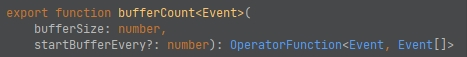

# rxjs-操作符-转换类、筛选类

> 这一节我们介绍转换类、筛选类操作符

## 转换操作符

顾名思义，转换即是返回你需要的新的值。在通过操作符链时进行值的转换是一个常见的任务。这些操作符提供了转换技术几乎可以涵盖你所能遇到的任何场景。

### buffer

用**数组**收集一个流发出的值，直到另一个流发出值，就把当前已收集到的值发出并释放。

```typescript
import { interval, fromEvent } from 'rxjs';
import { buffer } from 'rxjs/operators';

const myInterval = interval(1000);
const bufferBy = fromEvent(document, 'click');
/*
  收集由 myInterval 发出的所有值，直到我们点击页面。此时 bufferBy 会发出值以完成缓存。
  将自上次缓冲以来收集的所有值传递给数组。
*/
const myBufferedInterval = myInterval.pipe(buffer(bufferBy));
// 例如 输出: [1,2,3] ... [4,5,6,7,8]
const subscribe = myBufferedInterval.subscribe(val =>
  console.log(' Buffered Values:', val)
);
```

### bufferCount

用**数组**收集一个流发出的值, 直到达到给定的最大值(第一个参数： ```bufferSize``` )，
如果指定了第二个参数： ```startBufferEvery``` （上一轮索引），意味着每次新一轮的收集会从上一轮指定索引的位置开始复用。



```typescript
import { interval } from 'rxjs';
import { bufferCount } from 'rxjs/operators';

const source = interval(1000);
// 在发出3个值后，将缓冲的值作为数组传递
const bufferThree = source.pipe(bufferCount(3));
// 输出: [0,1,2]...[3,4,5]
const subscribe = bufferThree.subscribe(val =>
  console.log('Buffered Values:', val)
);
```

```typescript
import { interval } from 'rxjs';
import { bufferCount } from 'rxjs/operators';

fromEvent(document, 'click')
  .pipe(
    pluck('clientX'),
    /*
    * 页面点击3次，达到缓存限度，输出长度为3的数组，类似： [743, 709, 1154]
    * 以后每点击一次，服用上一次从位置1开始的数组，类似： [743, 709, 560]
    * */
    bufferCount(3, 1)
  )
  .subscribe(res => console.log(res));
```

### bufferTime

收集发出的值，直到经过了提供的时间(第一个参数： ```bufferTimeSpan``` )，才将其作为数组发出，
如果指定了第二个参数： ```bufferCreationInterval``` （间隔时间），就会等待这个时间再次发送下一个流。

```typescript
import { interval } from 'rxjs';
import { bufferTime } from 'rxjs/operators';

const source = interval(500);
// 2秒后，将缓冲值作为数组发出
const example = source.pipe(bufferTime(2000));
// 输出: [0,1,2] [3,4,5,6] [7,8,9,10]...
const subscribe = example.subscribe(val =>console.log(val));
```

```typescript
import { interval } from 'rxjs';
import { bufferTime } from 'rxjs/operators';

interval(500)
  .pipe(
    /*
    * 在1秒时推送第一个流： [0]
    * 此后，每等待3秒推送下一个：[5,6,7] [11,12,13]...
    * */
    bufferTime(1000, 3000)
  )
  .subscribe(res => console.log(res));
```

### bufferToggle

在指定的缓冲时间段内收集所有的值，到时间后关闭该时间段并发出所有的值。

```typescript
import { interval } from 'rxjs';
import { bufferToggle } from 'rxjs/operators';

const sourceInterval = interval(1000);
const startInterval = interval(5000);
const closingInterval = val => {
  console.log(`${val} 开始缓冲! 3秒后关闭`);
  return interval(3000);
};
// 每5秒会开启一个新的缓冲区以收集发出的值，3秒后发出缓冲的值，并关闭当前缓冲区
const bufferToggleInterval = sourceInterval.pipe(
  bufferToggle(
    startInterval,
    closingInterval
  )
);
const subscribe = bufferToggleInterval.subscribe(val =>
  console.log('Emitted Buffer:', val)
);
```

### bufferWhen

收集值，直到指定的 ```Observable``` 发出值。

```typescript
// RxJS v6+
import { interval } from 'rxjs';
import { bufferWhen } from 'rxjs/operators';

const oneSecondInterval = interval(1000);
const fiveSecondInterval = () => interval(5000);
// 每5秒发出缓冲的值
const bufferWhenExample = oneSecondInterval.pipe(bufferWhen(fiveSecondInterval));
// 输出: [0,1,2,3] [4,5,6,7,8]...
const subscribe = bufferWhenExample.subscribe(val =>
  console.log('Emitted Buffer: ', val)
);
```

### map

类似数组 ```map``` ,对源 ```observable``` 的每个值进行映射。

```typescript
import { from } from 'rxjs';
import { map } from 'rxjs/operators';

const source = from([1, 2, 3, 4, 5]);
const example = source.pipe(map(val => val + 10));
const subscribe = example.subscribe(val => console.log(val));
```

### mapTo

对源 ```observable``` 的每个值映射成一个指定的值。

```typescript
import { interval } from 'rxjs';
import { mapTo } from 'rxjs/operators';

const source = interval(2000);
// 将所有发出值映射成同一个值
const example = source.pipe(mapTo('HELLO WORLD!'));
// 输出: 'HELLO WORLD!'...'HELLO WORLD!'...'HELLO WORLD!'...
const subscribe = example.subscribe(val => console.log(val));
```

### switchMap

把源 ```observable``` 发出的每个值，经过处理，映射成新的 ```observable``` ，但每次都会**取消上一次**的 ```observable``` ，不管上次 ```observable``` 是否完成。此操作符可以取消正在进行中的网络请求！

```typescript
const clicks = fromEvent(document, 'click');
const result = clicks.pipe(switchMap((ev) => interval(1000)));
// 每次点击都会重新开始执行interval的流，从0开始打印值
result.subscribe(x => console.log(x));
```

### switchMapTo

把源 ```observable``` 发出的每个值，经过处理，映射成固定的值(不限于 ```observable``` )

```typescript
const clicks = fromEvent(document, 'click');
const result = clicks.pipe(switchMapTo('hello'));
// 每次点击打印出'hello'
result.subscribe(x => console.log(x));
```

### concatMap

将源 ```observable``` 发出的每个值，**按顺序**映射成一个新的 ```observable```。

```typescript
import { of } from 'rxjs';
import { concatMap, delay, mergeMap } from 'rxjs/operators';

const source = of(2000, 1000);
// 将内部 observable 映射成 source，当前一个完成时发出结果并订阅下一个
const example = source.pipe(
  concatMap(val => of(`Delayed by: ${val}ms`).pipe(delay(val)))
);
// 输出: With concatMap: Delayed by: 2000ms, With concatMap: Delayed by: 1000ms
const subscribe = example.subscribe(val =>
  console.log(`With concatMap: ${val}`)
);

// 展示 concatMap 和 mergeMap 之间的区别
const mergeMapExample = source
  .pipe(
    // 只是为了确保 meregeMap 的日志晚于 concatMap 示例
    delay(5000),
    mergeMap(val => of(`Delayed by: ${val}ms`).pipe(delay(val)))
  )
  .subscribe(val => console.log(`With mergeMap: ${val}`));
```

 ```concatMap``` 和 ```mergeMap``` 之间的区别:

因为 ```concatMap``` 之前前一个内部 ```observable``` 完成后才会订阅下一个， ```source``` 中延迟 2000ms 值会先发出。 
对比的话， ```mergeMap``` 会**立即订阅所有**内部 ```observables```， 延迟少的 ```observable``` (1000ms) 会先发出值，然后才是 2000ms 的 ```observable``` 。


