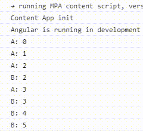

# rxjs-操作符-多播操作符

> 这一节介绍RxJs多播操作符

## 单播和多播

单播：之前我们看到的所有 ```Observable``` 都是单播的，即源头有值发出时，不管这个 ```Observable``` 被几个 ```Observer``` 订阅，我一次只会给一个 ```Observer``` 推送。

多播：当源头有值发出时，这个值会同一时间发给所有的 ```Observer``` 。

简单来说，单播与多播的区别类似于，```concat``` 和 ```merge``` 的区别。

单播：

```typescript
import { range } from 'rxjs';

const source$ = range(5);
// 先输出A: 0...再输出B: 0...
source$.subscribe(value => console.log('A: ' + value));
source$.subscribe(value => console.log('B: ' + value));
```

多播：

```typescript
import { range, Subject } from 'rxjs';

const source$ = range(5);
const subject$ = new Subject();
subject$.subscribe(value => console.log('A: ' + value));
subject$.subscribe(value => console.log('B: ' + value));
source$.subscribe(subject$); // 输出A: 0 B: 0 A: 1 B: 1... 交替输出
```


## Subject

 ```Subject``` 是一种特殊的 ```Observable``` ，而且是多播的。

既然是 ```Observable``` ，当然可以正常的被 ```subscribe``` ，只不过每个 ```Observer``` 都会存在一份```list```中(这也是多播的原因)，一旦有值发出，每个 ```Observer``` 都会同时收到值。

 ```Subject``` 还是 ```Observer``` ，可以执行 ```next()```, ```error()``` , ```complete()``` 的方法。

下面示范创建一个 ```Subject``` , 并且有两个 ```Observer``` 订阅它：

```typescript
import { Subject } from 'rxjs';

const subject = new Subject<number>();
subject.subscribe({
  next: (v) => console.log(`A: ${v}`)
});
subject.subscribe({
  next: (v) => console.log(`B: ${v}`)
});
subject.next(1);
subject.next(2);
// 输出: A: 1 B: 1 A: 2 B: 2
```

 ```Subject``` 既然也是个 ```Observer``` ，自然可以作为 ```subscribe``` 的参数传入：

```typescript
import { Subject, from } from 'rxjs';

const subject = new Subject<number>();
subject.subscribe({
  next: (v) => console.log(`A: ${v}`)
});
subject.subscribe({
  next: (v) => console.log(`B: ${v}`)
});
// 作为Observer传入
from([1, 2]).subscribe(subject);
// 输出: A: 1 B: 1 A: 2 B: 2
```

上面这个例子，通过 ```Subject``` 将单播的 ```Observable``` 转成了多播的。

## Subject的三个子类

-  ```BehaviorSubject``` 

-  ```ReplaySubject``` 

-  ```AsyncSubject``` 

### BehaviorSubject

 ```BehaviorSubject``` 可以储存最新发送的一个值，只要有新的 ```Observer``` 订阅，就立马推送当前的最新值。

当在定时器中使用 ```Subject``` ：

```typescript
import { Subject } from 'rxjs';

const subject = new Subject<number>();
subject.subscribe(value => console.log('A ' + value));
range(1, 2).subscribe(value => subject.next(value));

setTimeout(() => {
  subject.next(3);
  // 这里是订阅不到的
  subject.subscribe(value => console.log('B ' + value));
}, 2000);
// 输出：A: 1 A: 2 隔两秒输出 A: 3
```

想要定时器里的 B 拿到最新值，只需改用 ```BehaviorSubject``` 。

 ```BehaviorSubject``` 必须指定一个初始值：

```typescript
const subject = new BehaviorSubject(0); // 初始值为 0，相当于next(0)
// 会输出: A: 0 A: 1 A: 2 隔两秒输出 A: 3 B: 3
```

### ReplaySubject

 ```ReplaySubject``` 可以指定推送最近的多少个值给新的 ```Observer``` ，而 ```BehaviorSubject``` 只会推最近的一个值。

```typescript
import { ReplaySubject } from 'rxjs';

const subject = new ReplaySubject<number>(2); // 缓存最近的两个值
subject.subscribe(value => console.log('A ' + value));
range(1, 3).subscribe(value => subject.next(value));

setTimeout(() => {
  subject.subscribe(value => console.log('B ' + value));
}, 2000);
// 输出：A: 1 A: 2 A: 3 隔两秒输出 B: 2 B: 3
```

还可以指定第二个参数， 设置缓存的有效期，单位```ms``` 。

```typescript
// 缓存2个值，并且只在3秒内有效，超过3秒新的Observer将不会订阅的任何值
const subject = new ReplaySubject<number>(2, 3000); 
```

## AsyncSubject

只在 ```Subject``` 结束时（一定调用```complete```方法），推送最后一个值。

```typescript
import { AsyncSubject } from 'rxjs';

const subject = new AsyncSubject<number>();
subject.subscribe(value => console.log('A ' + value));

range(1, 3).subscribe(value => subject.next(value));
setTimeout(() => {
  subject.subscribe(value => console.log('B ' + value));
  }, 2000);
// 输出 A: 3 隔两秒输出 B: 3
subject.complete(); // 不调用是不会输出值的
```

## 冷和热

 ```Observable``` 其实可以分为两种：

-  ```Cold Observable``` ：一个 ```Observable``` 不管被多少个 ```Observer``` 订阅，总是从头开始推送，每个 ```Observer``` 相互独立。

-  ```Hot Observable``` ：每一个新的 ```Observer``` 会从源 ```Observable``` 发出的最新值开始接收，例如上面介绍的（大概可以理解为‘断点续传’）。

## 多播操作符

从上面例子可以看出， ```Subject``` 是实现多播的一种方式，```rxjs```提供了一些多播类的操作符也可以将单播的 ```Observable``` 转成了多播的。

### multicast

类似使用 ```Subject``` 创建多播，也是做同样的事情。

```typescript
import { ConnectableObservable, interval, Subject } from 'rxjs';
import { multicast } from 'rxjs/operators';

const source = interval(500);
const multicasted = source.pipe(multicast(new Subject())) as ConnectableObservable<number>;
let subscriptionA, subscriptionB, subscriptionConnect;

// 相当于 `subject.subscribe({...})`:
subscriptionA = multicasted.subscribe(v => console.log('A: ' + v));
// 相当于, `source.subscribe(subject)`:
subscriptionConnect = multicasted.connect();
setTimeout(() => {
  subscriptionB = multicasted.subscribe(v => console.log('B: ' + v));
}, 1000);
setTimeout(() => {
  subscriptionA.unsubscribe();
}, 2000);
setTimeout(() => {
  subscriptionB.unsubscribe();
  // subscriptionB退订后，source已经没有订阅者了，要加上这句才是真正的退订
  subscriptionConnect.unsubscribe();
}, 3000);
```



 ```multicast``` 返回一个 ```ConnectableObservable``` , 它的 ```connect``` 方法决定源 ```Observable``` 何时开始推送值，并返回 ```Subscription``` ，支持取消订阅。

### refCount

如果觉的 ```multicast``` 必须调用 ```connect``` 方法才能推送值，还要 ```multicasted.unsubscribe()``` 才能真正结束推送有些麻烦，就可以用 ```refCount``` 。

 ```refCount``` ：当有 ```Observer``` 订阅源 ```Observable``` 时，自动调用 ```connect``` ，当 ```Observer``` 全部 ```unsubscribe``` 后，即没有 ```Observer``` 了，自动调用 ```connect().unsubscribe()``` 退订。

```typescript
const source = interval(500);
const refCounted = source.pipe(
  multicast(new Subject()),
  refCount()
);
let subscriptionA, subscriptionB;
subscriptionA = refCounted.subscribe(v => console.log('A: ' + v));

setTimeout(() => {
  subscriptionB = refCounted.subscribe(v => console.log('B: ' + v));
  }, 1000);

setTimeout(() => {
  subscriptionA.unsubscribe();
  }, 2000);

setTimeout(() => {
  subscriptionB.unsubscribe();
  }, 3000);
```

### publish

 ```multicast(new Subject())``` 这段代码很常用，可用 ```publish``` 将其简化。

上个例子可以做如下简化:

```typescript
const refCounted = source.pipe(multicast(new Subject()), refCount());
// 等价于
const refCounted = source.pipe(publish(), refCount());
```

既然 ```multicast(new Subject()) === publish()``` ，那么 ```multicast(new publishBehavior())``` 呢？

与 ```Subject``` 类似， ```publish``` 也有三个变种方法：

-  ```publishBehavior(0)```  =>  ```new BehaviorSubject(0)```  
  
-  ```publishReplay(2)```  =>  ```new ReplaySubject(2)```  
  
-  ```publishLast()```  =>  ```new AsyncSubject()```  

### share

如果你觉得上面的例子还是不够简单，那么 ```share``` 可以解决你的烦恼。

```typescript
const refCounted = source.pipe(publish(), refCount());
// 等价于
const shared = source.pipe(share());
```

既然有了这个，我们干嘛还用前面的那些复杂的 &#128578; &#128578;

### shareReplay

```typescript
import { range } from 'rxjs';
import { shareReplay } from 'rxjs/operators';

const shared = range(0, 4).pipe(
  shareReplay(2)
);
shared.subscribe(res => console.log('A: ' + res));
setTimeout(() => {
  shared.subscribe(res => console.log('B: ' + res));
}, 2000);
// 输出：A: 0 A: 1 A: 2 A: 3 隔两秒输出：B: 2 B: 3
```

至此， ```RxJs``` 的基本操作符就介绍到这里。

