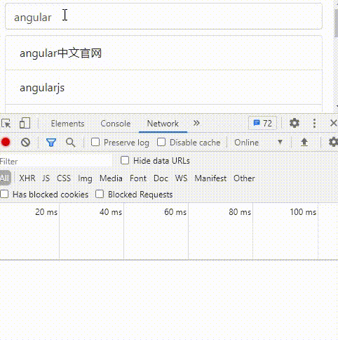

# demo练习

> 学了再多的概念，如果没有实战，都是徒劳。这一节将写一个输入框搜索请求后台数据，显示在页面上的例子。

创建一个 ```rxjs-demo``` 组件，并采用 ```OnPush``` 策略：

```shell
ng g c components/rxjs-demo -c OnPush -s -t
```

### 需求分析

1. 获取输入框 ```input``` 时的值；

2. 通过输入值请求接口，返回数据；
   - 每次键入，只请求最新的 ```value``` 
   - 根据键入速度，节流
   - 如果 ```input``` 的 ```value``` 没发生变化，不重复请求

3. 错误处理。

<hr>

### 页面代码：

```html
<div class="container">
  <div class="autocomplete mt-2">
    <input #input class="form-control" placeholder="search..." />
    <ul class="list-group mt-2">
      <li class="list-group-item" *ngFor="let item of resList">{{item?.q}}</li>
    </ul>
  </div>
</div>
```

### 封装百度请求服务


因为百度接口是 ```JSONP``` 请求， ```rxjs``` 提供的 ```ajax``` 操作符不支持，所以我们需要使用一个请求插件并安装：[jsonp-good](https://github.com/rikochyou/jsonp-good)

```typescript
import {from, Observable} from 'rxjs';
import jsonpG from 'jsonp-good';

interface BaiduRes {
  q: string;
}

@Injectable()
class BaiduService {
  readonly url = 'https://www.baidu.com/sugrec';
  list(wd: string): Observable<BaiduRes[]> {
    // 因为这个插件返回的是Promise，所以用from转换
    return from(jsonpG({
      url: this.url,
      funcName: 'jQuery110203052522071732855_1604236886158',
      params: {
        prod: 'pc',
        from: 'pc_web',
        wd
      }
    }).then((res: {g: BaiduRes[]}) => res.g));
  }
}
```

### 获取input输入值

获取 ```DOM``` ：

```typescript
@ViewChild('input', {static: true}) private inputEl: ElementRef;
```

在 ```ngAfterViewInit``` 中获取输入框值： 

```typescript
ngAfterViewInit(): void {
  fromEvent(this.inputEl.nativeElement, 'input').pipe(
    debounceTime(500), // 键入0.5秒后输出值，并忽略0.5秒间隔内的输入
    pluck('target', 'value')
  ).subscribe(res => {
    console.log(res);
  });
}
```

这样就能拿到我们想要的值，按照传统的做法，我们可能另外写一个方法来使用值请求数据，但是现在为何不直接使用 ```RxJs``` 一起处理请求呢？

```typescript
fromEvent(this.inputEl.nativeElement, 'input').pipe(
  debounceTime(500), // 键入0.5秒后输出值，并忽略0.5秒间隔内的输入
  pluck('target', 'value'),
  switchMap((value: string) => this.baiduServer.list(value)) // 每一次请求之前会取消上一次的请求
).subscribe(res => {
  this.resList = res;
  console.log('resList', this.resList); // und
});
```

通常情况下，这样的操作是可以实现功能的，但是会发现，每次请求， ```resList``` 能够获取到，但是页面并更新。

因为：在 ```OnPush``` 策略下，虽然 ```input``` 事件会触发变更检测，但是后面的请求是异步操作。当输入时，请求并没有返回结果，也就不会有变化。所以，我们需要手动触发变更检测。

```typescript
...
constructor(private baiduServer: BaiduService, private cdr: ChangeDetectorRef) { }
...
fromEvent(this.inputEl.nativeElement, 'input').pipe(
  debounceTime(500), // 键入0.5秒后输出值，并忽略0.5秒间隔内的输入
  pluck('target', 'value'),
  switchMap((value: string) => this.baiduServer.list(value))// 每一次请求之前会取消上一次的请求
).subscribe(res => {
  this.resList = res;
  this.cdr.markForCheck(); // 手动变更检测
});
```


这样，看起来得到了我们想要的效果，但是，你会发现，如果输入框值被删完，或者直接粘贴上一次的输入值，都会发送请求。这是毫无意义的请求，所以，需要优化：



```typescript
fromEvent(this.inputEl.nativeElement, 'input').pipe(
  debounceTime(500), // 键入0.5秒后输出值，并忽略0.5秒间隔内的输入
  pluck('target', 'value'),
  distinctUntilChanged(), // 只有本次value与上一次value不一致时才发射数据
  switchMap((value: string) => value.length ? this.baiduServer.list(value) : of([]))// 每一次请求之前会取消上一次的请求
).subscribe(res => {
  this.resList = res;
  this.cdr.markForCheck(); // 手动变更检测
});
```

至此，我们想要的功能全部实现。完整代码：

```typescript
// rxjs-demo.component.ts
import {
  Component,
  OnInit,
  ChangeDetectionStrategy,
  Injectable,
  AfterViewInit,
  ViewChild,
  ElementRef,
  ChangeDetectorRef
} from '@angular/core';
import {from, fromEvent, Observable, of, throwError} from 'rxjs';
import jsonpG from 'jsonp-good';
import {catchError, debounceTime, distinctUntilChanged, pluck, switchMap} from 'rxjs/operators';

interface BaiduRes {
  q: string;
}

@Injectable()
class BaiduService {
  readonly url = 'https://www.baidu.com/sugrec';
  list(wd: string): Observable<BaiduRes[]> {
    // 因为这个插件返回的是Promise，所以用from转换
    return from(jsonpG({
      url: this.url,
      funcName: 'jQuery110203052522071732855_1604236886158',
      params: {
        prod: 'pc',
        from: 'pc_web',
        wd
      }
    }).then((res: {g: BaiduRes[]}) => res.g));
  }
}

@Component({
  selector: 'app-rxjs-demo',
  template: `
    <div class="container">
      <div class="autocomplete mt-2">
        <input #input class="form-control" placeholder="search..." />
        <ul class="list-group mt-2">
          <li class="list-group-item" *ngFor="let item of resList">{{item?.q}}</li>
        </ul>
      </div>
    </div>
  `,
  styles: [],
  changeDetection: ChangeDetectionStrategy.OnPush,
  providers: [BaiduService]
})
export class RxjsDemoComponent implements OnInit, AfterViewInit {
  @ViewChild('input', {static: true}) private inputEl: ElementRef;
  resList: BaiduRes[];
  constructor(private baiduServer: BaiduService, private cdr: ChangeDetectorRef) { }

  ngOnInit(): void {}

  ngAfterViewInit(): void {
    fromEvent(this.inputEl.nativeElement, 'input').pipe(
      debounceTime(500), // 键入0.5秒后输出值，并忽略0.5秒间隔内的输入
      pluck('target', 'value'),
      distinctUntilChanged(), // 只有本次value与上一次value不一致时才发射数据
      // 每一次请求之前会取消上一次的请求
      switchMap((value: string) => value.length ? this.baiduServer.list(value) : of([])),
      catchError(err => throwError(err))
    ).subscribe(
      res => {
        this.resList = res;
        this.cdr.markForCheck(); // 手动变更检测
      },
      error => console.error(error)
    );
  }
}
```

这虽然是一个简单的Demo，但是依旧能看出使用 ```RxJs```的一个比较完整的流程。相比传统写法，函数式编程会给人一种‘一环扣一环’的感觉，逻辑清晰。虽然可能开始不知道选择什么样的操作符，但是学每一种新技术不都是这样走过来的吗？写的多了，自然就简单了。希望与大家一起进步！

