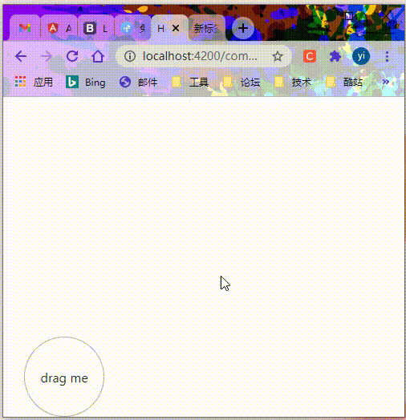
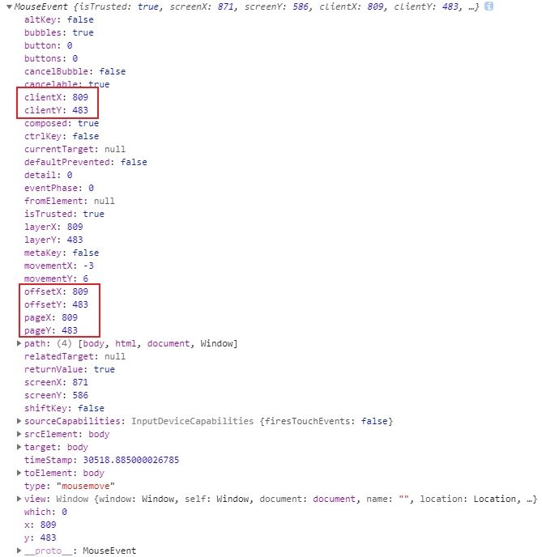
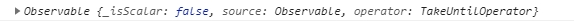
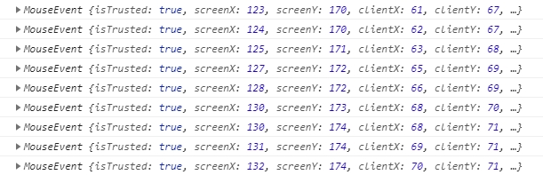
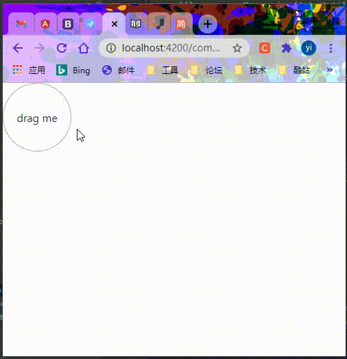
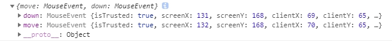
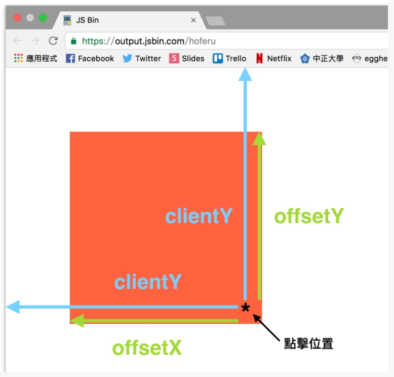

# rxjs 拖拽练习

> 为了练习rxjs操作符，本节将实现一个基础的拖拽功能。

先来看具体效果：



实现原理：通过鼠标移动，计算鼠标在页面中的位置，从而改变DOM元素绝对定位的```left```、```top```值。

实现思路：

1. 首先css设置```DOM```元素为绝对定位；

2. 捕获鼠标点击之后的鼠标移动事件，实时计算鼠标位置，直到```mouseup```;

3. 边界判断并实时修改位置。

先来一个边界判断计算值的方法：

```typescript
getValue(value, max, min): number {
  return Math.min(Math.max(value, min), max);
}
```

静态页面代码:

```html
<p class="drag" #drag>drag me</p>
```

获取```DOM```元素：

```typescript
@ViewChild('drag', {static: true}) dragEl: ElementRef;
```

绑定事件：

```typescript
const mouseDown = fromEvent(this.dragEl.nativeElement, 'mousedown');
const mouseUp = fromEvent(document.body, 'mouseup');
const mouseMove = fromEvent(document.body, 'mousemove');
```

首先我们来看看 ```mouseDown``` 所发射的流：

```typescript
mouseDown.subscribe(res => console.log(res));
```



返回一个 ```MouseEvent``` 对象，包含了我们想要的各种信息。

同理，```mouseMove``` 所发射的流也是 ```MouseEvent``` 对象。

鼠标点击之后，我们需要的是 ```mouseMove``` 发射的流：

```typescript
mouseDown.pipe(
  map(() => mouseMove),
)
```

直到鼠标抬起停止发射：

```typescript
mouseDown.pipe(
  map(() => mouseMove.pipe(takeUntil(mouseUp))),
)
```

不过此时，打印日志却是这样的：



所以，我们需要将这个```Observable``` 通过 ```concatAll``` 展开：

```typescript
mouseDown.pipe(
  map(() => mouseMove.pipe(takeUntil(mouseUp))),
  concatAll()
)
```

这样，我们就能获取到一个个的 ```MouseEvent``` 对象，就能拿到我们想要的 ```clientX``` 、 ```clientY```。




```typescript
mouseDown.pipe(
  map(() => mouseMove.pipe(takeUntil(mouseUp))),
  concatAll(),
  map((e: MouseEvent) => {
    return {
      x: e.clientX,
      y: e.clientY
    };
  })
).subscribe(res => {
  this.dragEl.nativeElement.style.left = res.x  + 'px';
  this.dragEl.nativeElement.style.top = res.y + 'px';
});
```

但是会发现，点击之后，鼠标一直在元素的左上方：



这样是不合理的，位置应该减去点击时鼠标距元素左上角的距离。

要获取最初点击时鼠标位置，我们就应该拿到点击时的流：

使用 ```withLatestFrom``` 就能拿到两个流：

```typescript
mouseDown.pipe(
  map(() => mouseMove.pipe(takeUntil(mouseUp))),
  concatAll(),
  withLatestFrom(mouseDown, (move: MouseEvent, down: MouseEvent) => ({move, down}))
);
```



同时，处理一下边界问题：

```typescript
    mouseDown.pipe(
      map(() => mouseMove.pipe(takeUntil(mouseUp))),
      concatAll(),
      withLatestFrom(mouseDown, (move: MouseEvent, down: MouseEvent) => {
        // 获取点击元素的宽高
        const {width, height} = (down.target as HTMLElement).getBoundingClientRect();
        return {
          x: this.getValue(move.clientX - down.offsetX, window.innerWidth - width, 0),
          y: this.getValue(move.clientY - down.offsetY, window.innerHeight - height, 0)
        };
      })
    ).subscribe(res => {
      this.dragEl.nativeElement.style.left = res.x  + 'px';
      this.dragEl.nativeElement.style.top = res.y + 'px';
    });
```

引用一张网图来说明 ```clientX``` 、 ```offsetX``` 的关系：



至此，功能全部实现。

完整代码：

```typescript
import {Component, OnInit, ChangeDetectionStrategy, AfterViewInit, ViewChild, ElementRef} from '@angular/core';
import {fromEvent} from 'rxjs';
import {concatAll, map, takeUntil, withLatestFrom} from 'rxjs/operators';

@Component({
  selector: 'app-drag',
  template: `
      <p class="drag" #drag>
        drag me
      </p>
  `,
  styles: [`
    .drag{
      width: 100px;
      height: 100px;
      border: 1px solid #afafaf;
      border-radius: 50%;
      text-align: center;
      line-height: 100px;
      cursor: pointer;
      position: absolute;
      -moz-user-select:none;
      -webkit-user-select:none;
      -ms-user-select:none;
      -khtml-user-select:none;
      user-select:none;
    }`
  ],
  changeDetection: ChangeDetectionStrategy.OnPush
})
export class DragComponent implements OnInit, AfterViewInit {
  @ViewChild('drag', {static: true}) dragEl: ElementRef;
  constructor() { }
  ngOnInit(): void {}

  ngAfterViewInit(): void {
    const mouseDown = fromEvent(this.dragEl.nativeElement, 'mousedown');
    const mouseUp = fromEvent(document.body, 'mouseup');
    const mouseMove = fromEvent(document.body, 'mousemove');
    mouseDown.pipe(
      map(() => mouseMove.pipe(takeUntil(mouseUp))),
      concatAll(),
      withLatestFrom(mouseDown, (move: MouseEvent, down: MouseEvent) => {
        const {width, height} = (down.target as HTMLElement).getBoundingClientRect();
        return {
          x: this.getValue(move.clientX - down.offsetX, window.innerWidth - width, 0),
          y: this.getValue(move.clientY - down.offsetY, window.innerHeight - height, 0)
        };
      })
    ).subscribe(res => {
      this.dragEl.nativeElement.style.left = res.x  + 'px';
      this.dragEl.nativeElement.style.top = res.y + 'px';
    });
  }
  getValue(value, max, min): number {
    return Math.min(Math.max(value, min), max);
  }
}
```
