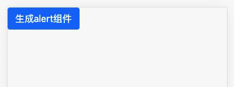

# 动态组件

> 如果说，之前在模版中调用的组件为静态组件（比如：```app-xxx```）
>
> 那么不用在模版里声明，而是通过```ts```动态插入到```dom```中到组件，可以视为动态组件

我们将通过一个```alert```组件来解释创建动态组件的步骤，最后效果如下：

 

## 创建静态组件

```
ng g c components/alert -s -c OnPush
```

 ```-c OnPush``` 就是更改```angular```变更检测策略，```--changeDetection=Default|OnPush``` 的简写，会自动在组件里添加OnPush模式:

 ```typescript
// alert.component.ts
...
@Component({
  selector: 'app-alert',
  // ...
  changeDetection: ChangeDetectionStrategy.OnPush
})
 ```

#### 先搭好组件的结构：

```html
<!-- alert.component.html -->
<div class="alert alert-primary" role="alert">
  <span class="content">这是一段提示文字</span>
  <i class="close">&times;</i>
</div>
```

 ```typescript
// alert.component.ts
...
@Component({
  selector: 'app-alert',
  templateUrl: './alert.component.html',
  styles: [`
    .close {display: block; width: 20px; height: 20px; position: absolute; right: 10px; top: 50%; margin-top: -15px; cursor: pointer;}
  `],
  changeDetection: ChangeDetectionStrategy.OnPush
})
 ```

页面表现：


#### 需求分析

1. 通过页面逻辑动态生成组件，这里就通过点击事件；

2. 可以动态加载内容及修改组件主题；

3. 关闭按钮销毁组件。

## 将alert组件所需参数动态化

```html
<!-- alert.component.html -->
<div [class]="wrapClass" role="alert">
  <span class="content">{{options.content}}</span>
  <i class="close" (click)="closed.emit();">&times;</i>
</div>
```

 ```typescript
// alert.component.ts
...
// 定义主题参数
type AlertTheme = 'primary' | 'danger' | 'warning' | 'secondary' | 'success' | 'info' | 'dark' | 'light';
// 限定参数
export interface AlertOption {
  content: string;
  theme?: AlertTheme;
}
@Component({
  selector: 'app-alert',
  templateUrl: './alert.component.html',
  styles: [`
    .close {display: block; width: 20px; height: 20px; position: absolute; right: 10px; top: 50%; margin-top: -15px; cursor: pointer;}
  `],
  changeDetection: ChangeDetectionStrategy.OnPush
})
export class AlertComponent implements OnInit {
  // Required将对象类型AlertOption的所有可选属性转化为必填属性
  options: Required<AlertOption> = {
    content: '',
    theme: 'primary',
  }
  // 注册关闭的输出事件
  @Output() readonly closed = new EventEmitter();
  constructor() { }
  ngOnInit(): void {}
  // 获取class
  get wrapClass(): string {
    return `alert alert-${this.options.theme}`
  }
  // 合并默认参数与传入的参数
  setOptions(options: AlertOption): void {
    this.options = {...this.options, ...options}
  }
}
 ```


## 父组件中实现动态调用逻辑

现在，我们不使用```<app-alert>```的方式调用，使用按钮动态创建：

```html
<!-- alert-box.component.html(父组件) -->
<div class="alert-comp">
  <!-- <app-alert></app-alert> -->
  <button class="btn btn-primary btn-small" (click)="showAlert()">生成alert组件</button>
</div>
```

### 实现逻辑

 ```typescript
// alert-box.component.ts(父组件)
import {Component, OnInit, ChangeDetectionStrategy, ComponentFactoryResolver, Injector, ComponentRef, ApplicationRef, EmbeddedViewRef} from '@angular/core';
import { AlertComponent } from '../alert/alert.component';

@Component({
  selector: 'app-alert-box',
  templateUrl: './alert-box.component.html',
  styles: [
 ],
  changeDetection: ChangeDetectionStrategy.OnPush
})
export class AlertBoxComponent implements OnInit {
  private component: AlertComponent;
  private componentRef: ComponentRef<AlertComponent>;
  constructor(
    private cfr: ComponentFactoryResolver,
    private inject: Injector,
    private appRef: ApplicationRef
  ) { }

  ngOnInit(): void {}
  // 实现按钮点击逻辑
  showAlert() {
    // 判断是否已经创建组件
    if(!this.component) {
      this.component = this.createContainer();
    }
    // 传递所需参数
    this.component.setOptions({content: '这是动态创建组件传入的内容', theme: 'success'})
  }
  // 创建
  private createContainer(): AlertComponent {
    /**
     * 1.创建组件工厂：
     * constructor中注入ComponentFactoryResolver这个类
     * 创建指定类型的组件工厂（生产指定类型的组件）
     * */
    const factory = this.cfr.resolveComponentFactory<AlertComponent>(AlertComponent);
    /**
     * 2.工厂创建ComponentRef
     * constructor中注入Injector这个类
     * 根据指定的类型，创建组件的实例
     */
    this.componentRef = factory.create(this.inject);
    /**
     * constructor中注入ApplicationRef这个类
     * 3.将组件试图添加到视图树中，以激活变更检测
     * */
    this.appRef.attachView(this.componentRef.hostView);
    // 4.将组件到模版(包括app-alert标签)，添加到body最后(当然，可以添加到任何位置)
    document.body.appendChild((this.componentRef.hostView as EmbeddedViewRef<{}>).rootNodes[0] as HTMLElement);
    // 5.监听组件销毁事件
    this.componentRef.onDestroy(() => {
      console.log('component destory');
    });
    // 获取组件实例，相当于用@ViewChild获取子组件一样
    const { instance } = this.componentRef;
    // 6.监听组件的output事件
    // subscribe是rxjs的内容，以后会介绍
    instance.closed.subscribe(() => {
      this.componentRef.destroy();
      this.component = null;
    });
    return instance;
  }
}
 ```

> 这一节介绍的东西还是比较生涩，引入的类也是平时不太常见的。但是没有关系，所有的东西用得多了也就熟悉了。如果你想创建一个动态组件，上面的操作步骤也是够用了。