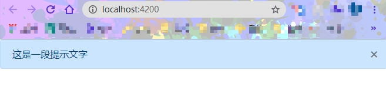

# 动态组件

> 如果说，之前在模版中调用的组件为静态组件（比如：```app-xxx```）
>
> 那么不用在模版里声明，而是通过```ts```动态插入到```dom```中到组件，可以视为动态组件

我们将通过一个```alert```组件来解释创建动态组件的步骤，最后效果如下：


## 创建静态组件

```
ng g c components/alert2 -s -c OnPush
```

 ```-c OnPush``` 就是更改```angular```变更检测策略，```--changeDetection=Default|OnPush``` 的简写，会自动在组件里添加OnPush模式:

 ```typescript
// alert.component.ts
...
@Component({
  selector: 'app-alert',
  // ...
  changeDetection: ChangeDetectionStrategy.OnPush
})
 ```

#### 先搭好组件的结构：

```html
<!-- alert.component.html -->
<div class="alert alert-primary" role="alert">
  <span class="content">这是一段提示文字</span>
  <i class="close">&times;</i>
</div>
```

 ```typescript
// alert.component.ts
...
@Component({
  selector: 'app-alert',
  templateUrl: './alert.component.html',
  styles: [`
    .close {display: block; width: 20px; height: 20px; position: absolute; right: 10px; top: 50%; margin-top: -15px; cursor: pointer;}
  `],
  changeDetection: ChangeDetectionStrategy.OnPush
})
 ```

页面表现：



#### 需求分析

1. 通过页面逻辑动态生成组件，这里就通过点击事件；

2. 可以动态加载内容及修改组件主题；

3. 关闭按钮销毁组件。

## 将alert组件所需参数动态化

 ```typescript
// alert.component.ts
...
// 定义主题参数
type AlertTheme = 'primary' | 'danger' | 'warning' | 'secondary' | 'success' | 'info' | 'dark' | 'light';
// 限定参数
export interface AlertOption {
  content: string;
  theme?: string;
}
@Component({
  selector: 'app-alert',
  templateUrl: './alert.component.html',
  styles: [`
    .close {display: block; width: 20px; height: 20px; position: absolute; right: 10px; top: 50%; margin-top: -15px; cursor: pointer;}
  `],
  changeDetection: ChangeDetectionStrategy.OnPush
})
export class AlertComponent implements OnInit {
  // Required将对象类型AlertOption的所有可选属性转化为必填属性
  options: Required<AlertOption> = {
    content: '',
    theme: 'primary',
  }
  constructor() { }
  ngOnInit(): void {}
  // 获取class
  get wrapClass(): string {
    return `alert alert-${this.options.theme}`
  }
  // 合并默认参数与传入的参数
  setOptions(options: AlertOption): void {
    this.options = {...this.options, ...options}
  }
}
 ```
 
```html
<!-- alert.component.html -->
<div [class]="wrapClass" role="alert">
  <span class="content">{{options.content}}</span>
  <i class="close">&times;</i>
</div>
```

## 父组件中实现动态调用逻辑

现在，我们不使用```<app-alert>```的方式调用，使用按钮动态创建：

```html
<!-- alert-box.component.html(父组件) -->
<div class="alert-comp">
  <!-- <app-alert></app-alert> -->
  <button class="btn btn-primary btn-small" (click)="showAlert()">生成alert组件</button>
</div>
```

### 实现逻辑

 ```typescript
// alert-box.component.ts(父组件)

```