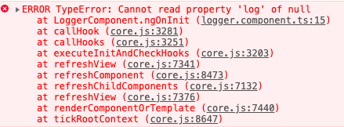
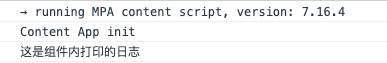
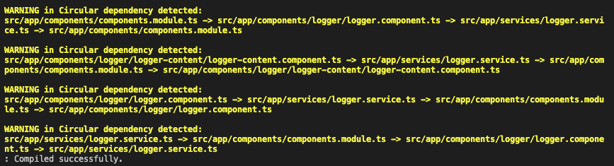
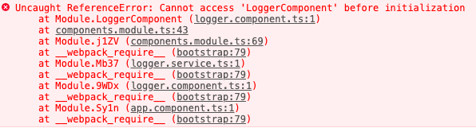

# 多级注入器

> ```Angular``` 中的注入器有一些规则，你可以利用这些规则来在应用程序中获得所需的可注入对象可见性。通俗的讲，这些规则指定了注入器的“作用域"。

## 两个注入器层次结构

```Angular``` 中有两个注入器层次结构：

1. ```ModuleInjector``` 层次结构 —— 在 ```@NgModule()``` 或 ```@Injectable()``` 中提供的服务。

2. ```ElementInjector``` 层次结构 —— 在 ```@Directive()``` 或 ```@Component()``` 中提供的服务。

## 服务查找规则(令牌解析规则)

1. 优先查找```ElementInjector```，如果当前组件找不到提供者，将会去父组件中的```ElementInjector```  

2. 当所有的```ElementInjector```都找不到，就会去```ModuleInjector```中找

3. 如果```ModuleInjector```也找不到，就会抛出一个错误

4. 对于同名的令牌，**只会解析遇到的第一个依赖**

## 解析修饰符

默认情况下，```Angular``` 始终从当前的 ```Injector``` 开始，并一直向上搜索。但修饰符使你可以更改开始（默认是自己）或结束位置。

- 如果 ```Angular``` 找不到你要的服务怎么办，用 ```@Optional()```阻止报错

- 用 ```@SkipSelf()```跳过自身，从父组件(指令)开始找

- 用```@Self()```只在当前组件(指令)找

- 用```@Host()```只在当前组件(指令)宿主上找

我们将创建一个```logger```组件和一个```logger```服务来验证上面的规则：

```typescript
// logger.service.ts
import { Injectable } from '@angular/core';
@Injectable()
export class LoggerService {
  constructor() { }
  log(message: string) {
    console.log(message);
  }
}
```

```typescript
// logger.component.ts
...
@Component({
  selector: 'app-logger',
  template: `<p>logger works!</p>`,
  changeDetection: ChangeDetectionStrategy.OnPush,
})
export class LoggerComponent implements OnInit {
  constructor(private loggerservice: LoggerService) { }
  ngOnInit(): void {
    this.loggerservice.log('这是组件内打印的日志');
  }
}
```

这样，我们没有在任何地方提供```logger```服务，浏览器会报没有提供服务的错：


当我们给服务加上```@Optional()```装饰器：

```typescript
// logger.component.ts
constructor(@Optional() private loggerservice: LoggerService) { }
```

在看浏览器日志，原来没有提供服务的错误已经修复：



当我们将在组件内```providers```没有提供服务，而在根模块中提供```logger```服务：

```typescript
// app.module.ts
@NgModule({
  //...
  providers: [LoggerService],
})
```

我们**明确知道自身组件没有提供服务时**，可以添加```@SkipSelf()```跳过自身：

```typescript
// logger.component.ts
constructor(@Optional() @SkipSelf() private loggerservice: LoggerService) { }
```
服务依旧可用：



```@Self()```同理，当明确知道只需要在自身组件内找服务时使用。

对于```@Self()```与```@Host()```的区别，官网有这么一句话：

```@Host()```会禁止在宿主组件以上的搜索。宿主组件通常就是请求该依赖的那个组件。 不过，当该组件投影进某个父组件时，那个父组件就会变成宿主。

那我们就使用投影来解释下这个区别。

```
ng g c components/logger/logger-content -s -t
```

```typescript
// logger.component.ts
@Component({
  selector: 'app-logger',
  template: `
  <div>
    <p>logger works!</p>
    <ng-content></ng-content>
  </div>
  `,
  providers: [LoggerService]
})
```

调用```logger-content```组件：

```html
<app-logger>
  <app-logger-content></app-logger-content>
</app-logger>
```

上面以内容投影的方式将```logger-content```组件引入到```logger```组件，并**只在**```logger```组件提供服务。

```typescript
// logger-content.component.ts
export class LoggerContentComponent implements OnInit {
  // 使用@Host()装饰器
  constructor(@Host() private loggerservice: LoggerService) { }
  ngOnInit(): void {
    this.loggerservice.log('logger-content 组件打印的内容！');
  }
}
```

通过```@Host()```，我们是可以获取到```logger-service```的，即用```@Host()```依然能访问父组件的```ElementInjector```。

我们知道，如果```logger-content```组件不是通过投影的方式引入，```app-logger-content```就是它的宿主。但是通过投影方式引入，引入它的组件就是它的宿主。（不太确定这样的说法是否正确，但通过```@Host()```装饰器的解释，或许可以这样理解）

其实一般情况下，```@Host()```可以完全替换```@Self()```的，他们之间的区别真的很微妙。

## 指定NgModule的注入

之前```providedIn: 'root'```指定从根模块中提供该服务，其实也可以像下面这样指定其它模块提供该服务。（这里有个前提：我们是将```logger```组件分配到```ComponentsModule```模块的）

```typescript
// logger.service.ts
@Injectable({
  providedIn: ComponentsModule
})
```

如果这么做，意味着这个服务无法在模块该模块内部使用，编辑器会报一个循环依赖的警告：



浏览器也会报错：



所以，只能在其它引入了```ComponentsModule```的```NgModule```中，才能使用该服务。

## viewProviders

使用 ```viewProviders``` 数组是在 ```@Component()``` 装饰器中提供服务的另一种方法。

上面说了，组件会从自身开始寻找服务，然后遍历父组件的```ElementInjector```，直到找到为。```viewProviders```也有这个特性，区别是，对投影内容不可见。

```viewProviders```的修饰符与```providers```的修饰符用法一致。

```html
<app-logger>
  <app-logger-content></app-logger-content>
</app-logger>
```

```LoggerContentComponent```无法找到```LoggerComponent```里用```viewProviders```提供的服务。

## 总结

Angular提供两个注入器层次结构：```ModuleInjector```层次结构及```ElementInjector``` 层次结构；

服务查找规则可以通俗的理解为‘就近原则’；

通过配置不同的解析修饰符，可以对程序进行一定程度的优化；

```viewProviders```对投影内容不可见。