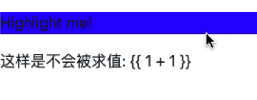
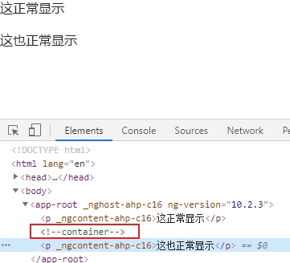
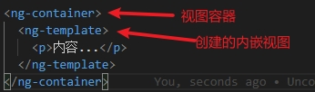
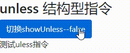

# 指令

> Angular 提供了两种内置指令：属性型指令和结构型指令。

## 属性型指令

> 属性型指令用于改变一个 DOM 元素的外观或行为，不会改变 DOM 结构。

### 组件是一种特殊的指令

为了验证这一点，我们来修改一点我们以前<code>app-ng-for</code>组件的代码：

```typescript
// ng-for.component.ts
// 修改组件里selector为属性选择器形式（我们之前说过，这里的值就是一个选择器而已）
@Component({
  selector: '[app-ng-for]',
  // ...
})
```

接下来，我们修改下调用组件的方式：

```typescript
// app.component.html
// 我们将div作为指令的宿主，app-ng-for作为一个属性即可
<div app-ng-for></div>
```

经过上面的改动，发现ng-for组件依然可以正常运行。从而证明了，***组件是一种特殊的指令***。

### 自定义属性型指令

1. cli在<code>src/directives</code>下自动生成highLight指令（当用户把鼠标悬停在一个元素上时，改变它的背景色）：

``` 
ng g d directives/highlight 
```

来看一下生成的默认代码：

```typescript
// highlight.directive.ts
import { Directive } from '@angular/core';
@Directive({
  selector: '[appHighlight]'
})
export class HighlightDirective {
  constructor() { }
}
```

可以看出，代码结构跟组件类似，使用了<code>@Directive</code>装饰器，传入的<code>selector</code>的值是属性选择器。并且，在<code>app.module.ts</code>中被自动引入：

```typescript
// app.module.ts
import { HighlightDirective } from './directives/highlight.directive';
...
@NgModule({
  declarations: [
    // ...
    HighlightDirective
  ],
  // ...
})
...
```

2. 使用：

```html
<!-- app.component.html -->
<p appHighlight>Highlight me!</p>
```

使用方式是如此简单，但是，根本没有任何效果啊。接下来，我们开始写正式的指令代码。

3. 实现指令：

首先，我们先分析下步骤：

- 找到我们要操作的DOM元素；

- 给元素添加鼠标移入移出事件；

- 修改传入的任意背景颜色；

首先，我们先来解决前两个问题：

```typescript
import { Directive, ElementRef, HostListener } from '@angular/core';
@Directive({
  selector: '[appHighlight]'
})
export class HighlightDirective {
  constructor(private el: ElementRef) { }
  @HostListener('mouseenter') onMouseEnter() {
    this.highlight('yellow');
  }
  @HostListener('mouseleave') onMouseLeave() {
    this.highlight(null);
  }
  private highlight(color: string) {
    this.el.nativeElement.style.backgroundColor = color;
  }
}
```


> 上面的代码解决了我们前两个问题：
>
> - 构造函数只负责声明要注入的元素 el: ElementRef
>
> - @HostListener 装饰器让你订阅某个属性型指令所在的宿主 DOM 元素的事件

对于第三个问题，我们需要使用输入属性来传值：

```typescript
import { Directive, ElementRef, HostListener, Input } from '@angular/core';
@Directive({
  selector: '[appHighlight]'
})
export class HighlightDirective {
  @Input() highlightColor: string;
  // ...
  @HostListener('mouseenter') onMouseEnter() {
    this.highlight(this.highlightColor);
  }
  // ...
}
```

```html
<!-- app.component.html -->
<p appHighlight highlightColor="blue">Highlight me!</p>
```

通过上面的代码，我们可以实现我们想要的功能。但是，你是否觉得写两个属性有点麻烦呢？下面我们通过**别名**来解决这个问题：

```typescript
...
export class HighlightDirective {
  @Input('appHighlight') highlightColor: string;
  // ...
}
```

```html
<!-- app.component.html -->
<p appHighlight="blue">Highlight me!</p>
```

以上，我们实现了我们全部需求。

### ngNonBindable

> 使用由模板引擎原生支持的 ngNonBindable 伪指令，可以让 Angular 不对模板中的表达式进行求值。
>
> 如果把 ngNonBindable 应用于某个父元素，就会在它的**所有子元素上禁用插值和任何类型的绑定**比如属性绑定或事件绑定。
>
> 不过，ngNonBindable 仍然允许指令作用于受 <code>ngNonBindable</code> 影响的元素上。

```html
<!-- app.component.html -->
<p ngNonBindable appHighlight="blue">Highlight me!</p>
<p ngNonBindable>这样是不会被求值: {{ 1 + 1 }}</p>
```
页面显示效果：



## 结构型指令

> 结构型指令的职责是 HTML 布局。会改变 DOM 结构，以星号（*）加指令的属性名作为标识

在正式了解结构型指令前，我们需要先了解一点基本知识。

### 星号（*）前缀

> *前面，我们了解过最常见的内置结构指令ng-if、ng-for。他们都是以星号（\*）开始，为什么呢？*
>
> *答：星号是一个用来简化更复杂语法的“语法糖”。 从内部实现来说，Angular 把 \*ngIf 属性 翻译成一个 <ng-template> 元素 并用它来包裹宿主元素。*

我们来做一个简单的示例来解释下这个“语法糖”：

```html
<!-- app.component.html -->
<div *ngIf="hero" class="name">{{hero.name}}</div>
<!-- 上面的写法展开后就是下面的写法： -->
<ng-template [ngIf]="hero">
  <div class="name">{{hero.name}}</div>
</ng-template>
```

### <ng-template>元素

> <ng-template>是一个 Angular 元素，用来渲染 HTML。 它**永远不会直接显示出来**。 事实上，在渲染视图之前，Angular 会把 <ng-template> 及其内容替换为一个注释。

```html
<!-- app.component.html -->
<p>这正常显示</p>
<ng-template>
  <p>这个不能显示</p>
</ng-template>
<p>这也正常显示</p>
```



*问：为什么移除而不是隐藏？*

*答：对于资源占用较多的组件，当隐藏掉一个元素时，组件的行为还在继续 —— 它仍然附加在它所属的 DOM 元素上， 它也仍在监听事件。这对于性能和内存方面是不利的。*

### <ng-container>元素

> <ng-container>也是一个 Angular 元素，主要用来分组，但它不会污染样式或元素布局，**因为 Angular 压根不会把它放进 DOM 中。**

### 创建unless指令

我们将创建一个叫UnlessDirective 的结构型指令，它是 NgIf 的反义词。 NgIf 在条件为 true 的时候显示模板内容，而 UnlessDirective 则会在条件为 false 时显示模板内容。

```
ng g d directives/unless
```

> *结构型指令原理：简单结构型指令会从 Angular 生成的 <ng-template> 元素中创建一个内嵌的视图，并把这个视图插入到一个视图容器中。*

大概可以理解成这样：



但是，我们要怎么让Angular创建上面那一块代码呢？请看下面代码：

```typescript
// unless.directive.ts
// 引入TemplateRef、ViewContainerRef
import { Directive, TemplateRef, ViewContainerRef } from '@angular/core';
@Directive({
  selector: '[appUnless]'
})
export class UnlessDirective {
  // 构造函数中注入TemplateRef、ViewContainerRef
  constructor(
    private templateRef: TemplateRef<any>,
    private viewContainer: ViewContainerRef
  ) { }
}
```

*这一步是将属性型指令转换为结构型指令重要一步。*

调用：

```html
<!-- app.component.html -->
<div>
  <h3>unless 结构型指令</h3>
  <p *appUnless>测试uless指令</p>
</div>
```

目前为止，我们unless这个结构型指令已经可以正常运行，但是，还没有功能。接下来，我们将通过传入的condition来动态渲染内容。

```typescript
// unless.directive.ts
import { Directive, Input, TemplateRef, ViewContainerRef } from '@angular/core';
...
export class UnlessDirective {
  private hasView = false; // 视图是否已经显示
  @Input() 
  set appUnless(condition: boolean) { // set用来监听属性变化
    if (!condition && !this.hasView) { // 传入的条件为false并且视图没有显示
      // 创建一个内嵌的视图，并把这个视图插入到一个视图容器中
      this.viewContainer.createEmbeddedView(this.templateRef); 
      this.hasView = true;
    } else if (condition && this.hasView) {
      this.viewContainer.clear();
      this.hasView = false;
    }
  }
  // ...
}
```

```html
<!-- app.component.html -->
<div>
  <h3>unless 结构型指令</h3>
  <button class="btn btn-primary" (click)="showUnless = !showUnless">切换showUnless--{{showUnless}}</button>
  <p *appUnless="showUnless">测试uless指令</p>
</div>
```

```typescript
// app.component.ts
...
export class AppComponent {
  showUnless = false;
}
...
```

页面效果：



至此，我们这个指令的基础功能已经实现。（作为基础，掌握到这个地步即可，如果你想给指令设置别名，请往下看）

首先，我们要实现的功能是这样的，设置别名un，并且在内部能直接使用：

```html
<p *appUnless="showUnless; let un">测试uless指令---{{un}}</p>
```

修改unless.directive.ts：

```typescript
// unless.directive.ts
...
export class UnlessDirective {
  @Input() 
  set appUnless(condition: boolean) { 
    if (!condition && !this.hasView) { 
      // 创建视图时，传入第二个参数即可
      this.viewContainer.createEmbeddedView(this.templateRef, {$implicit: condition}); 
      // ...
    } 
  }
  // ...
}
```

## 总结

> *1. 创建指令命令：ng g d 指令名*
>
> *2. 属性型指令不改变 DOM 结构，结构型指令会改变*
>
> *3. 使用 @HostListener 装饰器订阅宿主事件*
>
> *4. ngNonBindable 下的子元素会禁用所有的插值和绑定*
>
> *5. 结构型指令以星号(\*)开始*
>
> *6. 注入TemplateRef、ViewContainerRef是结构型指令的关键*
>
