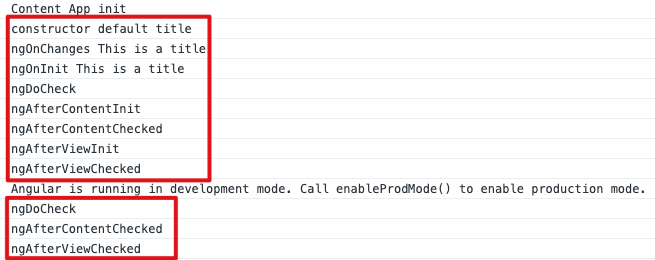
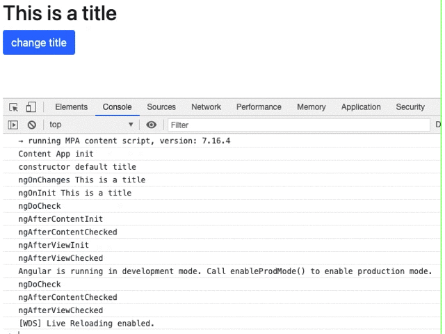

# 生命周期

> 对于单页面应用来说，组件的生命周期在开发中至关重要。了解生命周期，在适当的时机处理不同的逻辑，从而使应用更加合理与健壮。

定义：当 ```Angular``` 实例化组件类并渲染组件视图及其子视图时，组件实例的生命周期就开始了。生命周期一直伴随着变更检测，```Angular``` 会检查数据绑定属性何时发生变化，并按需更新视图和组件实例。当 ```Angular``` 销毁组件实例并从 ```DOM``` 中移除它渲染的模板时，生命周期就结束了。

tips：演示将在```life-cycle```组件中进行。

## 生命周期顺序

```Angular```有以下8个生命周期钩子函数，并按照下面顺序调用：

- ```ngOnChanges()```

- ```ngOnInit()```

- ```ngDoCheck()```

- ```ngAfterContentInit()```

- ```ngAfterContentChecked()```

- ```ngAfterViewInit()```

- ```ngAfterViewChecked()```

- ```ngOnDestroy()```

下面我们将所有钩子都打印一遍，可以看到他们的执行顺序：



可以看出， ```ngDoCheck``` 、 ```ngAfterContentChecked``` 、 ```ngAfterViewChecked``` 被执行了两遍（他们仨总是一起执行），而且我们并没有做任何让 ```DOM``` 改变的操作，并且不管组件中有没有 ```content``` 投影， ```ngAfterContentChecked``` 依旧会一并执行。

当我们改变页面上DOM时，又只会再次执行这三个钩子：



### ngOnChanges()

> **输入属性**发生变化时触发，但组件内部改变输入属性是不会触发的。

```html
<!-- life-cycle.component.html -->
<div class="life-cycle">
  <h2>{{title}}</h2>
  <button class="btn btn-primary" (click)="changeTitle()">change title</button>
</div>
```

添加一个输入属性 ```title``` 并赋一个默认值，以及组件内部修改 ```title``` 的方法。

```typescript
// life-cycle.component.ts
import { Component, Input, OnChanges, OnInit, SimpleChanges } from '@angular/core';
...
// 注入OnChanges钩子
export class LifeCycleComponent implements OnChanges, OnInit {
  // 声明输入属性变量，并赋予默认值
  @Input() title: string = 'default title';
  constructor() { 
    console.log('constructor', this.title); // default title
  }
  ngOnChanges(changes: SimpleChanges): void {
    console.log('ngOnChanges', this.title); // This is a title
  }
  ngOnInit(): void {
    console.log('ngOnInit', this.title); // This is a title
  }
  changeTitle() {
    this.title = 'new title';
  }
}
```

父组件传入 ```title```

```html
<!-- app.component.html -->
<app-life-cycle title="This is a title"></app-life-cycle>
```


从结果来看，我们可以得出以下结论：

1. 调用顺序依次是 ```constructor``` 、 ```ngOnChanges``` 、 ```ngOnInit``` ；

2. ```constructor``` 是拿不到输入属性改变后的值，只能取到默认值；

3. 组件内部修改**输入属性**是会成功，但是不会触发 ```ngOnChanges``` 钩子。

### ngOnInit

> 只在组件/指令初始化调用一次，建议在这个钩子中获取组件初始化的数据，而构造函数中只适合写简单的逻辑，比如初始化局部变量。

### ngDoCheck 

> 变更检测，并在发生 ```Angular``` 无法或不愿意自己检测的变化时作出反应。

## ngOnDestroy

> 组件销毁时触发一次，在这里应该清理一些残存的状态（事件、定时器等）

我们通过 ```ngIf``` 来控制组件的销毁与创建：

```html
<!-- app.component.html -->
<button class="btn btn-primary" (click)="show = !show">toggle life-cycle</button>
<app-life-cycle title="This is a title" *ngIf="show"></app-life-cycle>
```


重新创建后，将会重新执行一遍生命周期的钩子函数。

tips: 其他钩子都能见名知意，就不介绍了。

## 总结

 *使用生命周期函数，首先应该注入钩子函数到组件，并且实现其对应方法；*

 *所有带有 ```init``` 字样的钩子只会执行一遍；*

 *```ngOnChanges``` 只会监听外部输入属性的变化。*

